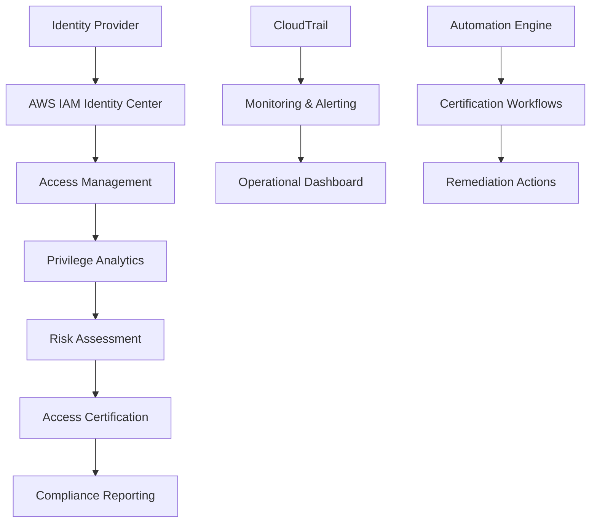

## Workshop Overview

This workshop will guide you through implementing a comprehensive Identity Governance system with Access Certification on AWS, including:

- **Access Governance**: Managing and controlling access rights
- **Certification Automation**: Automating access certification processes
- **Privilege Analytics**: Analyzing and monitoring privileges
- **Risk Assessment**: Security risk evaluation
- **Monitoring Setup**: Setting up continuous monitoring
- **Operational Procedures**: Operational processes
- **Audit Procedures**: Audit processes
- **Compliance Validation**: Compliance verification

## Overall Architecture

## AWS Services Used

- **AWS IAM Identity Center** - Centralized access management
- **AWS Organizations** - Multi-account governance
- **AWS CloudTrail** - Audit logging
- **AWS Config** - Compliance monitoring
- **AWS Lambda** - Automation functions
- **Amazon EventBridge** - Event-driven automation
- **Amazon S3** - Data storage
- **Amazon Athena** - Analytics queries
- **Amazon QuickSight** - Reporting dashboard
- **AWS Systems Manager** - Operational management

## Benefits of Identity Governance

### 1. Enhanced Security
- Strict access control
- Security risk detection and prevention
- Continuous activity monitoring

### 2. Regulatory Compliance
- Meet SOX, SOC2, ISO27001 requirements
- Automated audit processes
- Compliance evidence storage

### 3. Operational Efficiency
- Automated certification processes
- Reduced manual work
- Improved management processes

## Completion Time

Approximately 4-6 hours (can be divided into multiple sessions)

## Next Steps

Continue to [2. Preparation Steps](../2-cac-buoc-chuan-bi) to start setting up the environment.