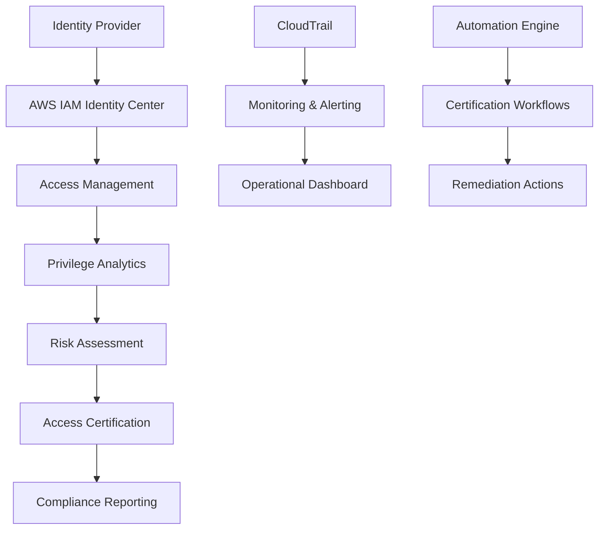

## Tổng quan Workshop

Workshop này sẽ hướng dẫn bạn triển khai một hệ thống Identity Governance toàn diện với Access Certification trên AWS, bao gồm:

- **Access Governance**: Quản lý và kiểm soát quyền truy cập
- **Certification Automation**: Tự động hóa quy trình xác nhận quyền
- **Privilege Analytics**: Phân tích và giám sát đặc quyền
- **Risk Assessment**: Đánh giá rủi ro bảo mật
- **Monitoring Setup**: Thiết lập giám sát liên tục
- **Operational Procedures**: Quy trình vận hành
- **Audit Procedures**: Quy trình kiểm toán
- **Compliance Validation**: Xác thực tuân thủ

## Kiến trúc Tổng thể

## AWS Services Sử dụng

- **AWS IAM Identity Center** - Centralized access management
- **AWS Organizations** - Multi-account governance
- **AWS CloudTrail** - Audit logging
- **AWS Config** - Compliance monitoring
- **AWS Lambda** - Automation functions
- **Amazon EventBridge** - Event-driven automation
- **Amazon S3** - Data storage
- **Amazon Athena** - Analytics queries
- **Amazon QuickSight** - Reporting dashboard
- **AWS Systems Manager** - Operational management

## Lợi ích của Identity Governance

### 1. Bảo mật nâng cao
- Kiểm soát quyền truy cập chặt chẽ
- Phát hiện và ngăn chặn rủi ro bảo mật
- Giám sát liên tục các hoạt động

### 2. Tuân thủ quy định
- Đáp ứng các yêu cầu SOX, SOC2, ISO27001
- Tự động hóa quy trình audit
- Lưu trữ bằng chứng tuân thủ

### 3. Hiệu quả vận hành
- Tự động hóa quy trình certification
- Giảm thiểu công việc thủ công
- Cải thiện quy trình quản lý

## Thời gian Hoàn thành

Khoảng 4-6 giờ (có thể chia thành nhiều session)

## Tiếp theo

Chuyển sang [2. Các bước chuẩn bị](../2-cac-buoc-chuan-bi) để bắt đầu thiết lập môi trường.