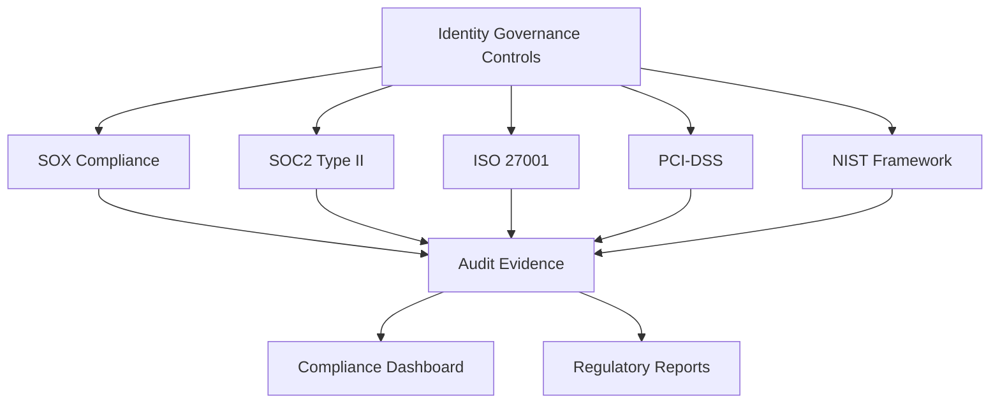

## Objective

Validate and maintain compliance with security frameworks and legal regulations through identity governance, ensuring the organization meets SOX, SOC2, ISO27001, PCI-DSS, and other standards.

## Compliance Framework Mapping

## Step 1: AWS Artifact for Compliance Documentation

### 1.1 Access AWS Artifact

1. Open **AWS Artifact** in the console
2. Review available compliance reports:
   - **SOC reports**
   - **PCI DSS documentation**
   - **ISO 27001 certification**

3. Download relevant compliance documents
4. Review AWS responsibility matrix

### 1.2 Map Controls to Frameworks

1. Create **compliance mapping spreadsheet**
2. Map identity governance controls to:
   - **SOX Section 302/404**
   - **SOC 2 Type II**
   - **ISO 27001 Annex A**
   - **PCI DSS Requirements**

3. Document **shared responsibility** model

## Step 2: Compliance Dashboard with Security Hub

### 2.1 Configure Compliance Standards

1. Open **AWS Security Hub**
2. Go to **Security standards**
3. Enable compliance standards:
   - **AWS Foundational Security Standard**
   - **CIS AWS Foundations Benchmark**
   - **PCI DSS**

4. Review **compliance scores** for each standard

### 2.2 Create Compliance Dashboard

1. Open **Amazon QuickSight**
2. Create **Compliance Dashboard**
3. Connect to Security Hub data

4. Add visualizations for:
   - **Overall compliance score**
   - **Framework-specific scores**
   - **Trending compliance metrics**
   - **Critical findings**

5. Set up **automated refresh** schedule

## Step 3: Automated Compliance Reporting

### 3.1 Set Up Report Generation

1. Create **S3 bucket** for compliance reports:
   - **Bucket name**: compliance-reports-[account-id]
   - **Versioning**: Enabled
   - **Retention**: 7 years

2. Configure **lifecycle policies** for long-term retention

### 3.2 Create Report Generation Lambda

1. Open **AWS Lambda**
2. Create function: **ComplianceReportGenerator**
3. Configure to generate reports from:
   - **Security Hub findings**
   - **Config compliance data**
   - **Audit Manager evidence**

### 3.3 Schedule Quarterly Reports

1. Open **Amazon EventBridge**
2. Create rule: **QuarterlyComplianceReporting**
3. Set schedule: **First day of quarter at 9 AM**

4. Configure **email delivery** via SES

## Step 4: Compliance Validation Testing

### 4.1 Test Compliance Controls

1. Use **Security Hub** findings to validate:
   - **IAM password policies**
   - **MFA requirements**
   - **Access key rotation**

2. Review **Lambda audit results** in DynamoDB
3. Document **control effectiveness**

### 4.2 Generate Compliance Evidence

1. Collect evidence from:
   - **CloudTrail logs**
   - **Security Hub findings**
   - **DynamoDB audit records**
   - **Lambda execution logs**

2. Store evidence in **S3 with encryption**
3. Create **evidence inventory** in DynamoDB

### 4.3 Validate Report Generation

1. Test **quarterly report generation**
2. Review report content and format
3. Validate **stakeholder distribution**

## Expected Results

After completing this workshop, you will have:

### ✅ Comprehensive Identity Governance System
- Centralized access management with AWS IAM Identity Center
- Automated access certification workflows
- Real-time privilege analytics and risk assessment
- Continuous monitoring and alerting

### ✅ Compliance Framework Implementation
- SOX, SOC2, ISO27001, PCI-DSS compliance validation
- Automated evidence collection via AWS services
- Regulatory reporting capabilities
- Audit trail maintenance in S3

### ✅ Operational Excellence
- CloudWatch dashboards for operations
- Automated incident response procedures
- Systems Manager runbooks
- Performance monitoring and alerting

### ✅ Audit and Governance
- AWS Audit Manager framework
- Automated control testing via Config
- Security Hub findings tracking
- QuickSight management reporting

## Best Practices Summary

1. **Implement Least Privilege**: Use IAM Identity Center permission sets
2. **Automate Where Possible**: Leverage AWS native automation services
3. **Monitor Continuously**: Use CloudWatch and Security Hub
4. **Document Everything**: Store evidence in S3 with proper retention
5. **Regular Reviews**: Schedule automated assessments
6. **Stay Updated**: Monitor AWS compliance documentation updates

## Reference Documentation

- [AWS IAM Identity Center Documentation](https://docs.aws.amazon.com/singlesignon/)
- [AWS Organizations Best Practices](https://docs.aws.amazon.com/organizations/)
- [SOX Compliance Guidelines](https://www.sec.gov/about/laws/soa2002.pdf)
- [SOC 2 Framework](https://www.aicpa.org/interestareas/frc/assuranceadvisoryservices/aicpasoc2report.html)
- [ISO 27001 Standard](https://www.iso.org/isoiec-27001-information-security.html)

## Support

If you encounter issues during deployment, please:
1. Check CloudWatch Logs for debugging
2. Review IAM permissions
3. Refer to AWS documentation
4. Contact support team if needed

**Workshop completed successfully! 🎉**

## Next Steps

Continue to [11. Clean Resources](../11-clean-resources) to clean up workshop resources.