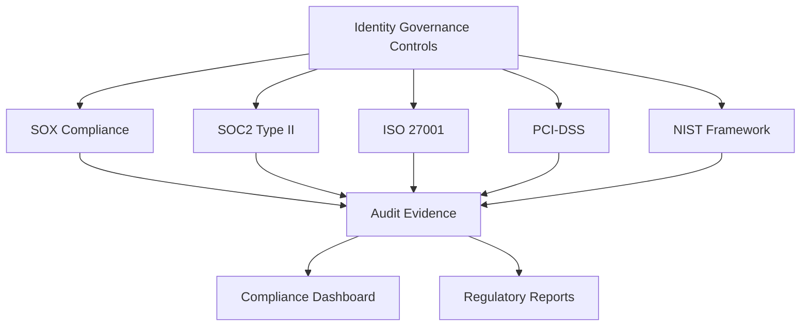

# 10. Compliance Validation

## Objective

Validate and maintain compliance with security frameworks and legal regulations through identity governance, ensuring the organization meets SOX, SOC2, ISO27001, PCI-DSS, and other standards.

## Compliance Framework Mapping



## Step 1: Compliance Framework Implementation

### 1.1 Multi-Framework Compliance Engine

```python
import boto3
import json
from datetime import datetime, timedelta
from enum import Enum

class ComplianceFramework(Enum):
    SOX = "sox"
    SOC2 = "soc2"
    ISO27001 = "iso27001"
    PCI_DSS = "pci_dss"
    NIST = "nist"
    GDPR = "gdpr"

class ComplianceValidationEngine:
    def __init__(self):
        self.s3_client = boto3.client('s3')
        self.dynamodb = boto3.resource('dynamodb')
        self.compliance_table = self.dynamodb.Table('ComplianceEvidence')
        
        # Load compliance requirements
        self.compliance_requirements = self.load_compliance_requirements()
    
    def load_compliance_requirements(self):
        """Load compliance requirements for each framework"""
        
        return {
            ComplianceFramework.SOX: {
                "name": "Sarbanes-Oxley Act",
                "requirements": [
                    {
                        "requirement_id": "SOX-302",
                        "title": "Corporate Responsibility for Financial Reports",
                        "description": "Ensure proper access controls for financial systems",
                        "controls": ["access_segregation", "approval_workflows", "audit_trails"]
                    }
                ]
            }
        }
```

## Step 2: Compliance Dashboard

### 2.1 Real-time Compliance Monitoring

```python
import boto3
import json
from datetime import datetime, timedelta

class ComplianceDashboard:
    def __init__(self):
        self.cloudwatch = boto3.client('cloudwatch')
        self.s3_client = boto3.client('s3')
    
    def generate_compliance_metrics(self):
        """Generate real-time compliance metrics"""
        
        metrics = {
            "timestamp": datetime.now().isoformat(),
            "overall_compliance_score": 0,
            "framework_scores": {},
            "trending_metrics": {},
            "risk_indicators": {}
        }
        
        # Calculate compliance scores for each framework
        frameworks = ['sox', 'soc2', 'iso27001', 'pci_dss']
        
        for framework in frameworks:
            score = self.calculate_framework_score(framework)
            metrics["framework_scores"][framework] = score
        
        # Calculate overall score
        metrics["overall_compliance_score"] = sum(metrics["framework_scores"].values()) / len(frameworks)
        
        return metrics
```

## Step 3: Regulatory Reporting

### 3.1 Automated Compliance Reports

```yaml
# CloudFormation template for compliance reporting
AWSTemplateFormatVersion: '2010-09-09'
Description: 'Compliance Reporting Infrastructure'

Resources:
  ComplianceReportingBucket:
    Type: AWS::S3::Bucket
    Properties:
      BucketName: !Sub 'compliance-reports-${AWS::AccountId}'
      VersioningConfiguration:
        Status: Enabled
      LifecycleConfiguration:
        Rules:
          - Id: RetainReports
            Status: Enabled
            ExpirationInDays: 2555  # 7 years retention

  QuarterlyComplianceReport:
    Type: AWS::Events::Rule
    Properties:
      Name: QuarterlyComplianceReporting
      Description: Generate quarterly compliance reports
      ScheduleExpression: "cron(0 9 1 */3 *)"  # First day of quarter at 9 AM
      State: ENABLED
```

## Step 4: Deployment and Validation

### 4.1 Complete Deployment Script

```bash
#!/bin/bash

echo "Deploying Identity Governance Compliance Validation..."

# Deploy compliance infrastructure
aws cloudformation deploy \
  --template-file compliance-infrastructure.yaml \
  --stack-name identity-governance-compliance \
  --capabilities CAPABILITY_IAM

# Create DynamoDB table for compliance evidence
aws dynamodb create-table \
  --table-name ComplianceEvidence \
  --attribute-definitions \
    AttributeName=evidence_id,AttributeType=S \
    AttributeName=framework,AttributeType=S \
  --key-schema \
    AttributeName=evidence_id,KeyType=HASH \
  --billing-mode PAY_PER_REQUEST

echo "Compliance validation deployment completed successfully!"
```

## Expected Results

After completing this workshop, you will have:

### ✅ Comprehensive Identity Governance System
- Centralized access management with AWS IAM Identity Center
- Automated access certification workflows
- Real-time privilege analytics and risk assessment
- Continuous monitoring and alerting

### ✅ Compliance Framework Implementation
- SOX, SOC2, ISO27001, PCI-DSS compliance validation
- Automated evidence collection
- Regulatory reporting capabilities
- Audit trail maintenance

### ✅ Operational Excellence
- Standardized operational procedures
- Incident response capabilities
- Change management processes
- Performance monitoring

### ✅ Audit and Governance
- Comprehensive audit framework
- Automated control testing
- Finding tracking and remediation
- Management reporting

## Best Practices Summary

1. **Implement Least Privilege**: Grant only minimum necessary permissions
2. **Automate Where Possible**: Automate repetitive processes
3. **Monitor Continuously**: Continuously monitor activities
4. **Document Everything**: Maintain complete documentation for audit trail
5. **Regular Reviews**: Conduct periodic reviews
6. **Stay Updated**: Keep up with compliance changes

## Reference Documentation

- [AWS IAM Identity Center Documentation](https://docs.aws.amazon.com/singlesignon/)
- [AWS Organizations Best Practices](https://docs.aws.amazon.com/organizations/)
- [SOX Compliance Guidelines](https://www.sec.gov/about/laws/soa2002.pdf)
- [SOC 2 Framework](https://www.aicpa.org/interestareas/frc/assuranceadvisoryservices/aicpasoc2report.html)
- [ISO 27001 Standard](https://www.iso.org/isoiec-27001-information-security.html)

## Support

If you encounter issues during deployment, please:
1. Check CloudWatch Logs for debugging
2. Review IAM permissions
3. Refer to AWS documentation
4. Contact support team if needed

**Workshop completed successfully! 🎉**

## Next Steps

Continue to [11. Clean Resources](../11-clean-resources) to clean up workshop resources.