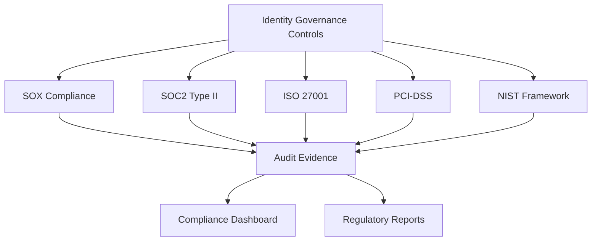

## Mục tiêu

Xác thực và duy trì tuân thủ các framework bảo mật và quy định pháp lý thông qua identity governance, đảm bảo tổ chức đáp ứng các yêu cầu SOX, SOC2, ISO27001, PCI-DSS và các tiêu chuẩn khác.

## Compliance Framework Mapping



## Bước 1: Compliance Framework Implementation

### 1.1 Multi-Framework Compliance Engine

```python
import boto3
import json
from datetime import datetime, timedelta
from enum import Enum

class ComplianceFramework(Enum):
    SOX = "sox"
    SOC2 = "soc2"
    ISO27001 = "iso27001"
    PCI_DSS = "pci_dss"
    NIST = "nist"
    GDPR = "gdpr"

class ComplianceValidationEngine:
    def __init__(self):
        self.s3_client = boto3.client('s3')
        self.dynamodb = boto3.resource('dynamodb')
        self.compliance_table = self.dynamodb.Table('ComplianceEvidence')
        
        # Load compliance requirements
        self.compliance_requirements = self.load_compliance_requirements()
    
    def load_compliance_requirements(self):
        """Load compliance requirements for each framework"""
        
        return {
            ComplianceFramework.SOX: {
                "name": "Sarbanes-Oxley Act",
                "requirements": [
                    {
                        "requirement_id": "SOX-302",
                        "title": "Corporate Responsibility for Financial Reports",
                        "description": "Ensure proper access controls for financial systems",
                        "controls": ["access_segregation", "approval_workflows", "audit_trails"]
                    }
                ]
            }
        }
```

## Bước 2: Compliance Dashboard

### 2.1 Real-time Compliance Monitoring

```python
import boto3
import json
from datetime import datetime, timedelta

class ComplianceDashboard:
    def __init__(self):
        self.cloudwatch = boto3.client('cloudwatch')
        self.s3_client = boto3.client('s3')
    
    def generate_compliance_metrics(self):
        """Generate real-time compliance metrics"""
        
        metrics = {
            "timestamp": datetime.now().isoformat(),
            "overall_compliance_score": 0,
            "framework_scores": {},
            "trending_metrics": {},
            "risk_indicators": {}
        }
        
        # Calculate compliance scores for each framework
        frameworks = ['sox', 'soc2', 'iso27001', 'pci_dss']
        
        for framework in frameworks:
            score = self.calculate_framework_score(framework)
            metrics["framework_scores"][framework] = score
        
        # Calculate overall score
        metrics["overall_compliance_score"] = sum(metrics["framework_scores"].values()) / len(frameworks)
        
        return metrics
```

## Bước 3: Regulatory Reporting

### 3.1 Automated Compliance Reports

```yaml
# CloudFormation template for compliance reporting
AWSTemplateFormatVersion: '2010-09-09'
Description: 'Compliance Reporting Infrastructure'

Resources:
  ComplianceReportingBucket:
    Type: AWS::S3::Bucket
    Properties:
      BucketName: !Sub 'compliance-reports-${AWS::AccountId}'
      VersioningConfiguration:
        Status: Enabled
      LifecycleConfiguration:
        Rules:
          - Id: RetainReports
            Status: Enabled
            ExpirationInDays: 2555  # 7 years retention

  QuarterlyComplianceReport:
    Type: AWS::Events::Rule
    Properties:
      Name: QuarterlyComplianceReporting
      Description: Generate quarterly compliance reports
      ScheduleExpression: "cron(0 9 1 */3 *)"  # First day of quarter at 9 AM
      State: ENABLED
```

## Bước 4: Deployment và Validation

### 4.1 Complete Deployment Script

```bash
#!/bin/bash

echo "Deploying Identity Governance Compliance Validation..."

# Deploy compliance infrastructure
aws cloudformation deploy \
  --template-file compliance-infrastructure.yaml \
  --stack-name identity-governance-compliance \
  --capabilities CAPABILITY_IAM

# Create DynamoDB table for compliance evidence
aws dynamodb create-table \
  --table-name ComplianceEvidence \
  --attribute-definitions \
    AttributeName=evidence_id,AttributeType=S \
    AttributeName=framework,AttributeType=S \
  --key-schema \
    AttributeName=evidence_id,KeyType=HASH \
  --billing-mode PAY_PER_REQUEST

echo "Compliance validation deployment completed successfully!"
```

## Kết quả Mong đợi

Sau khi hoàn thành workshop này, bạn sẽ có:

### ✅ Comprehensive Identity Governance System
- Centralized access management với AWS IAM Identity Center
- Automated access certification workflows
- Real-time privilege analytics và risk assessment
- Continuous monitoring và alerting

### ✅ Compliance Framework Implementation
- SOX, SOC2, ISO27001, PCI-DSS compliance validation
- Automated evidence collection
- Regulatory reporting capabilities
- Audit trail maintenance

### ✅ Operational Excellence
- Standardized operational procedures
- Incident response capabilities
- Change management processes
- Performance monitoring

### ✅ Audit và Governance
- Comprehensive audit framework
- Automated control testing
- Finding tracking và remediation
- Management reporting

## Best Practices Summary

1. **Implement Least Privilege**: Chỉ cấp quyền tối thiểu cần thiết
2. **Automate Where Possible**: Tự động hóa các quy trình lặp lại
3. **Monitor Continuously**: Giám sát liên tục các hoạt động
4. **Document Everything**: Ghi chép đầy đủ cho audit trail
5. **Regular Reviews**: Thực hiện review định kỳ
6. **Stay Updated**: Cập nhật theo các thay đổi compliance

## Tài liệu Tham khảo

- [AWS IAM Identity Center Documentation](https://docs.aws.amazon.com/singlesignon/)
- [AWS Organizations Best Practices](https://docs.aws.amazon.com/organizations/)
- [SOX Compliance Guidelines](https://www.sec.gov/about/laws/soa2002.pdf)
- [SOC 2 Framework](https://www.aicpa.org/interestareas/frc/assuranceadvisoryservices/aicpasoc2report.html)
- [ISO 27001 Standard](https://www.iso.org/isoiec-27001-information-security.html)

## Hỗ trợ

Nếu bạn gặp vấn đề trong quá trình triển khai, vui lòng:
1. Kiểm tra CloudWatch Logs để debug
2. Xem lại IAM permissions
3. Tham khảo AWS documentation
4. Liên hệ team support nếu cần thiết

**Workshop hoàn thành thành công! 🎉**