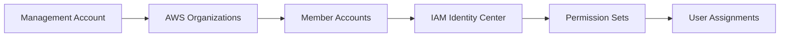

# 3. Access Governance Setup

## Objective

Set up centralized access management foundation with AWS IAM Identity Center and Organizations.

## Architecture



## Step 1: AWS Organizations Setup

### 1.1 Create Organization

```bash
aws organizations create-organization --feature-set ALL
```

### 1.2 Create Organizational Units

```json
{
  "Name": "Security",
  "ParentId": "r-xxxx"
}
```

```bash
aws organizations create-organizational-unit \
  --parent-id r-xxxx \
  --name "Security"
```

## Step 2: Configure IAM Identity Center

### 2.1 Enable IAM Identity Center

```bash
aws sso-admin create-instance \
  --name "IdentityGovernance" \
  --description "Identity Governance Instance"
```

### 2.2 Create Permission Sets

```json
{
  "Name": "SecurityAuditor",
  "Description": "Read-only access for security auditing",
  "SessionDuration": "PT8H",
  "ManagedPolicies": [
    "arn:aws:iam::aws:policy/SecurityAudit",
    "arn:aws:iam::aws:policy/ReadOnlyAccess"
  ]
}
```

## Step 3: Identity Store Setup

### 3.1 Configure External Identity Provider

```python
import boto3

def setup_external_idp():
    client = boto3.client('identitystore')
    
    # Configure SAML IdP
    response = client.create_external_id_provider(
        IdentityStoreId='d-xxxxxxxxxx',
        ExternalIdProvider={
            'Type': 'SAML',
            'Configuration': {
                'MetadataDocument': 'metadata_content',
                'LoginUrl': 'https://idp.company.com/login',
                'LogoutUrl': 'https://idp.company.com/logout'
            }
        }
    )
    return response
```

## Expected Results

After completing this step, you will have:

- ✅ AWS Organizations configured with OUs
- ✅ IAM Identity Center activated
- ✅ Permission Sets for governance roles
- ✅ Identity Store with groups and users
- ✅ Automation scripts for management

## Next Steps

Continue to [4. Certification Automation](../4-tu-dong-hoa-certification) to set up automated certification processes.