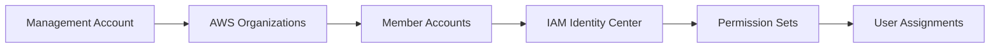

## Objective

Set up centralized access management foundation with AWS IAM Identity Center and Organizations.

## Architecture

## Step 1: AWS Organizations Setup

### 1.1 Create Organization

1. Đăng nhập vào AWS Console với tài khoản root
2. Tìm kiếm và mở service **AWS Organizations**
3. Click **Create organization**

4. Chọn **Enable all features** để có đầy đủ tính năng quản lý
5. Click **Create organization**

### 1.2 Create Organizational Units

1. Trong AWS Organizations console, click **AWS accounts** ở sidebar
2. Click **Actions** → **Create organizational unit**

3. Nhập tên OU: **Security**
4. Click **Create organizational unit**

## Step 2: Configure IAM Identity Center

### 2.1 Enable IAM Identity Center

1. Tìm kiếm và mở **IAM Identity Center** trong AWS Console
2. Click **Enable** để kích hoạt IAM Identity Center

3. Chọn region để lưu trữ identity store
4. Click **Create AWS organization** nếu chưa có

### 2.2 Create Permission Sets

1. Trong IAM Identity Center, click **Permission sets** ở sidebar
2. Click **Create permission set**

3. Chọn **Predefined permission set**
4. Chọn **SecurityAudit** từ dropdown

5. Nhập thông tin:
   - **Name**: SecurityAuditor
   - **Description**: Read-only access for security auditing
   - **Session duration**: 8 hours

6. Click **Next** và **Create**

## Step 3: Identity Store Setup

### 3.1 Create Users and Groups

1. Trong IAM Identity Center, click **Users** ở sidebar
2. Click **Add user**

3. Nhập thông tin user:
   - **Username**: security-auditor
   - **Email**: auditor@company.com
   - **First name**: Security
   - **Last name**: Auditor

4. Click **Next** và **Add user**

### 3.2 Create Groups

1. Click **Groups** ở sidebar
2. Click **Create group**

3. Nhập:
   - **Group name**: SecurityAuditors
   - **Description**: Security auditing team

4. Click **Create group**

### 3.3 Assign Users to Groups

1. Chọn group **SecurityAuditors**
2. Click **Add users to group**

3. Chọn user **security-auditor**
4. Click **Add users**

## Step 4: Assign Access

### 4.1 Assign Permission Sets to Accounts

1. Click **AWS accounts** ở sidebar
2. Chọn account cần assign quyền
3. Click **Assign users or groups**

4. Chọn **Groups** tab
5. Chọn group **SecurityAuditors**
6. Click **Next**

7. Chọn permission set **SecurityAuditor**
8. Click **Next** và **Submit**

## Expected Results

After completing this step, you will have:

- ✅ AWS Organizations configured with OUs
- ✅ IAM Identity Center activated
- ✅ Permission Sets for governance roles
- ✅ Identity Store with groups and users
- ✅ Access assignments configured

## Next Steps

Continue to [4. Certification Automation](../4-tu-dong-hoa-certification) to set up automated certification processes.