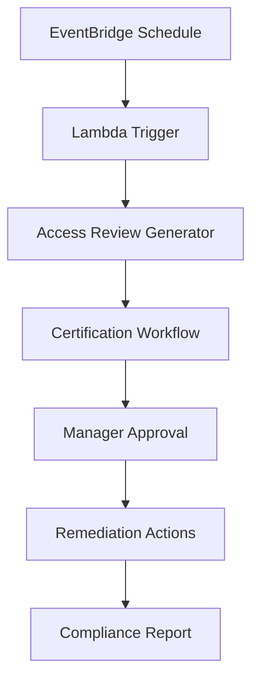

## Objective

Automate access certification processes to ensure access rights are reviewed periodically and comply with security requirements.

## Automation Architecture

## Step 1: EventBridge Scheduler Setup

### 1.1 Create Scheduled Rule

1. Open **Amazon EventBridge** in AWS Console
2. Click **Rules** in the sidebar
3. Click **Create rule**

4. Enter rule details:
   - **Name**: AccessCertificationSchedule
   - **Description**: Quarterly access certification review
   - **Event bus**: default

5. In **Define pattern**, select **Schedule**
6. Choose **Fixed rate every** and enter **90 days**

7. Click **Next**

## Step 2: Lambda Function Setup

### 2.1 Create Lambda Function

1. Open **AWS Lambda** in the console
2. Click **Create function**

3. Choose **Author from scratch**
4. Enter function details:
   - **Function name**: AccessCertificationTrigger
   - **Runtime**: Python 3.9
   - **Architecture**: x86_64

5. Click **Create function**

### 2.2 Configure Lambda Function Code

1. In the **Code** tab, replace the default code
2. Upload the certification logic code

3. Click **Deploy** to save changes

### 2.3 Set Environment Variables

1. Go to **Configuration** tab
2. Click **Environment variables**
3. Click **Edit**

4. Add required variables:
   - **S3_BUCKET**: certification-data-bucket
   - **SNS_TOPIC**: certification-notifications

## Step 3: Step Functions Workflow

### 3.1 Create State Machine

1. Open **AWS Step Functions** in the console
2. Click **Create state machine**

3. Choose **Write your workflow in code**
4. Select **Standard** type

5. Enter the workflow definition in JSON format
6. Name the state machine: **AccessCertificationWorkflow**

### 3.2 Configure IAM Role

1. Create or select an IAM role for Step Functions
2. Ensure it has permissions to invoke Lambda functions

3. Click **Create state machine**

## Step 4: Connect EventBridge to Lambda

### 4.1 Add Lambda Target to EventBridge Rule

1. Go back to **EventBridge** console
2. Select the rule **AccessCertificationSchedule**
3. Click **Targets** tab
4. Click **Add target**

5. Configure target:
   - **Target type**: AWS service
   - **Service**: Lambda function
   - **Function**: AccessCertificationTrigger

6. Click **Add** and then **Update rule**

## Step 5: Test the Automation

### 5.1 Manual Test Execution

1. In EventBridge, select your rule
2. Click **Actions** → **Test rule**

3. Monitor Lambda function execution in CloudWatch Logs

## Expected Results

After completion:

- ✅ Automated quarterly access reviews
- ✅ EventBridge scheduled triggers
- ✅ Lambda function processing
- ✅ Step Functions workflow orchestration
- ✅ Audit trail and monitoring

## Next Steps

Continue to [5. Privilege Analytics](../5-phan-tich-dac-quyen) to set up privilege analysis.