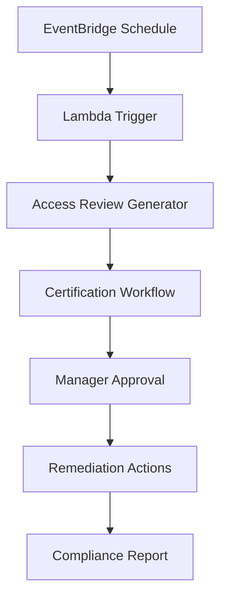

## Objective

Automate access certification processes to ensure access rights are reviewed periodically and comply with security requirements.

## Automation Architecture

## Step 1: EventBridge Scheduler Setup

### 1.1 Create Scheduled Rule

1. Open **Amazon EventBridge** in AWS Console
2. Click **Rules** in the sidebar
3. Click **Create rule**

#### Step 1: Define rule detail
4. Enter rule information:
   - **Name**: `AccessCertificationSchedule`
   - **Description**: `Quarterly access certification review`
   - **Event bus**: default
   - **Enable the rule on the selected event bus**: ✅ Checked

5. In **Rule type**, select **Schedule**
   - Choose "A rule that runs on a schedule"
6. Click **Next**

#### Step 2: Define schedule
7. In **Occurrence**, select **Recurring schedule**
   - Choose "Recurring schedule" because we want to run quarterly reviews
8. In **Schedule pattern**, select **Rate-based schedule**
9. Enter **90** and select **Days**
10. In **Flexible time window**, enter **15** minutes
    - Allows the schedule to run within 15 minutes after the start time
    - Helps reduce system load and increases flexibility
11. Click **Next**

## Step 2: Lambda Function Setup

### 2.1 Create Lambda Function

1. Open **AWS Lambda** in the console
2. Click **Create function**

3. Choose **Author from scratch**
4. Enter function details:
   - **Function name**: AccessCertificationTrigger
   - **Runtime**: Python 3.9
   - **Architecture**: x86_64

5. Click **Create function**

### 2.2 Configure Lambda Function Code

1. In the **Code** tab, replace the default code
2. Upload the certification logic code

3. Click **Deploy** to save changes

### 2.3 Set Environment Variables

1. Go to **Configuration** tab
2. Click **Environment variables**
3. Click **Edit**

4. Add required variables:
   - **S3_BUCKET**: certification-data-bucket
   - **SNS_TOPIC**: certification-notifications

## Step 3: DynamoDB Setup for Certification Data

### 3.1 Create DynamoDB Table

1. Open **Amazon DynamoDB** in the console
2. Click **Create table**

3. Enter table details:
   - **Table name**: AccessCertifications
   - **Partition key**: UserId (String)
   - **Sort key**: CertificationDate (String)
   - **Billing mode**: On-demand
4. Click **Create table**

### 3.2 Configure Lambda for DynamoDB Integration

1. Return to Lambda function **AccessCertificationTrigger**
2. Add DynamoDB permissions to IAM role
3. Update code to write certification records

## Step 4: Connect EventBridge to Lambda

### 4.1 Add Lambda Target to EventBridge Rule

#### Step 3: Select target
1. In **Target API**, select **AWS Lambda**
2. Choose API **Invoke**
3. In **Lambda function**, select **AccessCertificationTrigger**

4. Click **Next**

#### Step 4: Configure tags (Optional)
5. Skip the tags section, click **Next**

#### Step 5: Review and create
6. Review configuration:
   - Rule name: AccessCertificationSchedule
   - Schedule: Rate(90 days)
   - Target: Lambda function
7. Click **Create rule**

## Step 5: Test the Automation

### 5.1 Manual Test Execution

1. In EventBridge, select your rule
2. Click **Actions** → **Test rule**

3. Monitor Lambda function execution in CloudWatch Logs

## Expected Results

After completion:

- ✅ Automated quarterly access reviews
- ✅ EventBridge scheduled triggers
- ✅ Lambda function processing
- ✅ Step Functions workflow orchestration
- ✅ Audit trail and monitoring

## Next Steps

Continue to [5. Privilege Analytics](../5-phan-tich-dac-quyen) to set up privilege analysis.