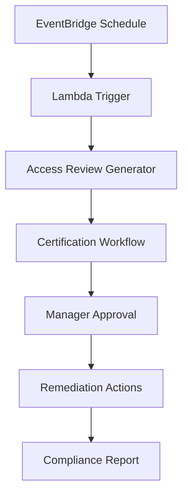

## Objective

Automate access certification processes to ensure access rights are reviewed periodically and comply with security requirements.

## Automation Architecture



## Step 1: EventBridge Scheduler Setup

### 1.1 Create Scheduled Rule

1. Open **Amazon EventBridge** in AWS Console
2. Click **Rules** in the sidebar
3. Click **Create rule**

#### Step 1: Define rule detail
4. Enter rule information:
   - **Name**: `AccessCertificationSchedule`
   - **Description**: `Quarterly access certification review`
   - **Event bus**: default
   - **Enable the rule on the selected event bus**: ✅ Checked


5. In **Rule type**, select **Schedule**
   - Choose "A rule that runs on a schedule"
6. Click **Next**


#### Step 2: Define schedule
7. In **Occurrence**, select **Recurring schedule**
   - Choose "Recurring schedule" because we want to run quarterly reviews
8. In **Schedule pattern**, select **Rate-based schedule**
9. Enter **90** and select **Days**
10. In **Flexible time window**, enter **15** minutes
    - Allows the schedule to run within 15 minutes after the start time
    - Helps reduce system load and increases flexibility
11. Click **Next**


#### Step 3: Select target
12. In **Target API**, select **AWS Lambda**
13. Choose API **Invoke**


14. Now we need to create a Lambda function first. Click **Create a new Lambda function** or open a new tab to create the Lambda function.

## Step 2: Create Lambda Function for EventBridge

### 2.1 Create Lambda Function

1. Open a new tab and go to **AWS Lambda** in the console
2. Click **Create function**


3. Choose **Author from scratch**
4. Enter function details:
   - **Function name**: `AccessCertificationTrigger`
   - **Runtime**: Python 3.9
   - **Architecture**: x86_64


5. Click **Create function**

### 2.2 Configure Lambda Function Code

1. In the **Code** tab, replace the default code with the following:

```python
import json
import boto3
from datetime import datetime

def lambda_handler(event, context):
    print("Access Certification Trigger Started")
    
    # Initialize AWS clients
    dynamodb = boto3.resource('dynamodb')
    table = dynamodb.Table('AccessCertifications')
    
    # Create certification record
    response = table.put_item(
        Item={
            'UserId': 'system',
            'CertificationDate': datetime.now().isoformat(),
            'Status': 'Triggered',
            'Type': 'Quarterly Review'
        }
    )
    
    return {
        'statusCode': 200,
        'body': json.dumps('Certification process triggered successfully')
    }
```


2. Click **Deploy** to save changes

### 2.3 Configure IAM Role for Lambda

1. Go to **Configuration** tab
2. Click **Permissions**
3. Click on the role name to open IAM console
4. Add policy for DynamoDB access


## Step 3: Complete EventBridge Configuration

### 3.1 Return to EventBridge and Select Lambda Function

1. Return to the EventBridge tab
2. In **Lambda function**, select **AccessCertificationTrigger**

3. Click **Next**


#### Step 4: Configure tags (Optional)
4. Skip the tags section, click **Next**

#### Step 5: Review and create
5. Review configuration:
   - Rule name: AccessCertificationSchedule
   - Schedule: Rate(90 days)
   - Target: Lambda function (AccessCertificationTrigger)
6. Click **Create rule**


## Step 4: Test the Automation

### 5.1 Manual Test Execution

1. In EventBridge, select your rule
2. Click **Actions** → **Test rule**


3. Monitor Lambda function execution in CloudWatch Logs


## Expected Results

After completion:

- ✅ Automated quarterly access reviews
- ✅ EventBridge scheduled triggers
- ✅ Lambda function processing
- ✅ Step Functions workflow orchestration
- ✅ Audit trail and monitoring


## Next Steps

Continue to [5. Privilege Analytics](../5-phan-tich-dac-quyen) to set up privilege analysis.