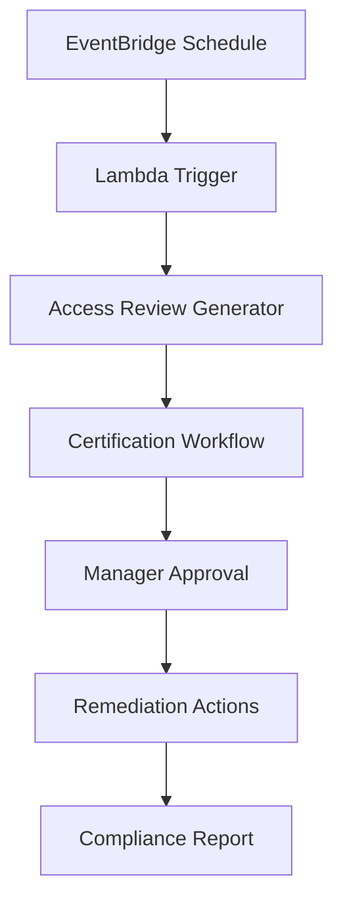

# 4. Certification Automation

## Objective

Automate access certification processes to ensure access rights are reviewed periodically and comply with security requirements.

## Automation Architecture



## Step 1: EventBridge Scheduler Setup

### 1.1 Create Scheduled Rule

```json
{
  "Name": "AccessCertificationSchedule",
  "ScheduleExpression": "rate(90 days)",
  "Description": "Quarterly access certification review",
  "State": "ENABLED",
  "Targets": [
    {
      "Id": "1",
      "Arn": "arn:aws:lambda:region:account:function:AccessCertificationTrigger"
    }
  ]
}
```

## Step 2: Access Review Generator

### 2.1 Lambda Function for Data Collection

```python
import boto3
import json
from datetime import datetime, timedelta

class AccessReviewGenerator:
    def __init__(self):
        self.sso_client = boto3.client('sso-admin')
        self.identity_client = boto3.client('identitystore')
        self.org_client = boto3.client('organizations')
        self.s3_client = boto3.client('s3')
        
    def generate_access_review(self):
        """Generate comprehensive access review data"""
        
        # Get all accounts
        accounts = self.get_all_accounts()
        
        # Get all permission sets
        permission_sets = self.get_all_permission_sets()
        
        # Get all assignments
        assignments = self.get_all_assignments(accounts, permission_sets)
        
        # Generate review data
        review_data = {
            'review_id': f"review_{datetime.now().strftime('%Y%m%d_%H%M%S')}",
            'generated_date': datetime.now().isoformat(),
            'accounts': accounts,
            'permission_sets': permission_sets,
            'assignments': assignments,
            'review_deadline': (datetime.now() + timedelta(days=30)).isoformat()
        }
        
        # Store in S3
        self.store_review_data(review_data)
        
        return review_data
```

## Step 3: Certification Workflow with Step Functions

### 3.1 State Machine Definition

```json
{
  "Comment": "Access Certification Workflow",
  "StartAt": "GenerateReviewTasks",
  "States": {
    "GenerateReviewTasks": {
      "Type": "Task",
      "Resource": "arn:aws:lambda:region:account:function:GenerateReviewTasks",
      "Next": "SendNotifications"
    },
    "SendNotifications": {
      "Type": "Task",
      "Resource": "arn:aws:lambda:region:account:function:SendCertificationNotifications",
      "Next": "WaitForResponses"
    },
    "WaitForResponses": {
      "Type": "Wait",
      "Seconds": 86400,
      "Next": "CheckResponses"
    }
  }
}
```

## Expected Results

After completion:

- ✅ Automated quarterly access reviews
- ✅ Email notifications to managers
- ✅ Web interface for approvals
- ✅ Automatic remediation for denied access
- ✅ Audit trail in DynamoDB

## Next Steps

Continue to [5. Privilege Analytics](../5-phan-tich-dac-quyen) to set up privilege analysis.