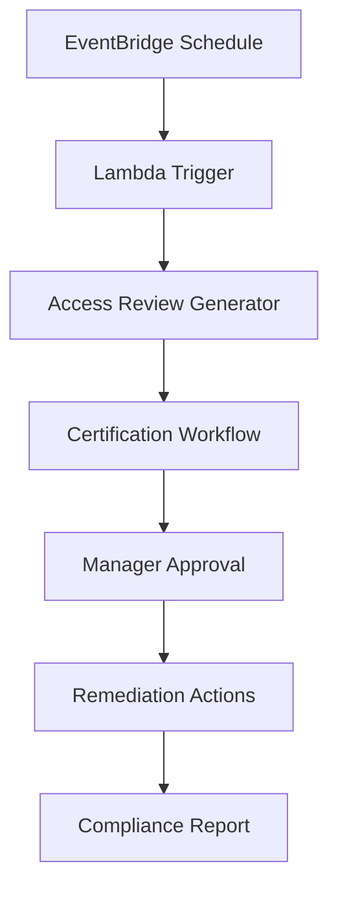

## Mục tiêu

Tự động hóa quy trình access certification để đảm bảo quyền truy cập được xem xét định kỳ và tuân thủ các yêu cầu bảo mật.

## Kiến trúc Automation

## Bước 1: Thiết lập EventBridge Scheduler

### 1.1 Tạo Scheduled Rule

1. Mở **Amazon EventBridge** trong AWS Console
2. Click **Rules** ở sidebar
3. Click **Create rule**

4. Nhập thông tin rule:
   - **Name**: AccessCertificationSchedule
   - **Description**: Quarterly access certification review
   - **Event bus**: default

5. Trong **Define pattern**, chọn **Schedule**
6. Chọn **Fixed rate every** và nhập **90 days**

7. Click **Next**

## Bước 2: Thiết lập Lambda Function

### 2.1 Tạo Lambda Function

1. Mở **AWS Lambda** trong console
2. Click **Create function**

3. Chọn **Author from scratch**
4. Nhập thông tin function:
   - **Function name**: AccessCertificationTrigger
   - **Runtime**: Python 3.9
   - **Architecture**: x86_64

5. Click **Create function**

### 2.2 Cấu hình Code cho Lambda Function

1. Trong tab **Code**, thay thế code mặc định
2. Upload logic code cho certification

3. Click **Deploy** để lưu thay đổi

### 2.3 Thiết lập Environment Variables

1. Chuyển đến tab **Configuration**
2. Click **Environment variables**
3. Click **Edit**

4. Thêm các biến cần thiết:
   - **S3_BUCKET**: certification-data-bucket
   - **SNS_TOPIC**: certification-notifications

## Bước 3: Quy trình Step Functions

### 3.1 Tạo State Machine

1. Mở **AWS Step Functions** trong console
2. Click **Create state machine**

3. Chọn **Write your workflow in code**
4. Chọn loại **Standard**

5. Nhập định nghĩa workflow ở định dạng JSON
6. Đặt tên state machine: **AccessCertificationWorkflow**

### 3.2 Cấu hình IAM Role

1. Tạo hoặc chọn IAM role cho Step Functions
2. Đảm bảo nó có quyền invoke Lambda functions

3. Click **Create state machine**

## Bước 4: Kết nối EventBridge với Lambda

### 4.1 Thêm Lambda Target vào EventBridge Rule

1. Quay lại **EventBridge** console
2. Chọn rule **AccessCertificationSchedule**
3. Click tab **Targets**
4. Click **Add target**

5. Cấu hình target:
   - **Target type**: AWS service
   - **Service**: Lambda function
   - **Function**: AccessCertificationTrigger

6. Click **Add** rồi **Update rule**

## Bước 5: Kiểm tra Tự động hóa

### 5.1 Thực thi Kiểm tra Thủ công

1. Trong EventBridge, chọn rule của bạn
2. Click **Actions** → **Test rule**

3. Giám sát thực thi Lambda function trong CloudWatch Logs

## Kết quả Mong đợi

Sau khi hoàn thành:

- ✅ Tự động hóa đánh giá truy cập hàng quý
- ✅ EventBridge scheduled triggers
- ✅ Lambda function xử lý
- ✅ Step Functions workflow orchestration
- ✅ Audit trail và giám sát

## Tiếp theo

Chuyển sang [5. Phân tích Đặc quyền](../5-phan-tich-dac-quyen) để thiết lập phân tích đặc quyền.