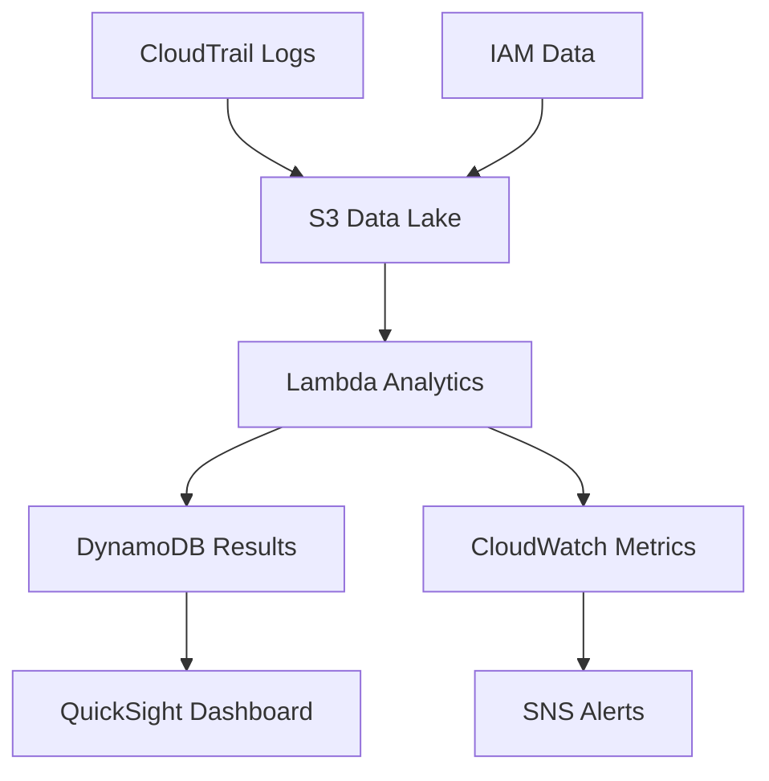

## Objective

Analyze and monitor privilege usage to detect security risks, excessive permissions, and anomalous patterns.

## Analytics Architecture

## Step 1: CloudTrail Setup for Data Collection

### 1.1 Create CloudTrail

1. Open **AWS CloudTrail** in the console
2. Click **Create trail**

3. Configure trail settings:
   - **Trail name**: PrivilegeAnalyticsTrail
   - **Apply trail to all regions**: Yes
   - **Management events**: Read and Write

4. Configure S3 bucket:
   - **Create new S3 bucket**: Yes
   - **S3 bucket name**: privilege-analytics-logs-[account-id]
   - **Log file prefix**: cloudtrail-logs/

5. Enable **Log file validation**
6. Click **Create trail**

## Step 2: Lambda Analytics Engine Setup

### 2.1 Create Lambda Function for Analytics

1. Open **AWS Lambda** in the console
2. Create new function: **PrivilegeAnalyticsEngine**
3. Choose runtime **Python 3.9**

### 2.2 Configure Lambda to Read S3 Data

1. Add IAM permissions for S3 and DynamoDB
2. Configure S3 trigger from bucket
3. Upload analytics code

### 2.3 Process Analytics Data

1. Lambda function processes CloudTrail logs
2. Calculates risk scores and usage patterns
3. Stores results in DynamoDB

## Step 3: QuickSight Dashboard Setup

### 3.1 Create QuickSight Account

1. Open **Amazon QuickSight** in the console
2. Sign up for QuickSight if not already done
3. Choose **Standard** edition

### 3.2 Create Data Source

1. Click **Datasets** in QuickSight
2. Click **New dataset**
3. Choose **Athena** as data source

4. Configure Athena connection:
   - **Data source name**: PrivilegeAnalytics
   - **Database**: privilege_analytics_db
   - **Table**: cloudtrail_logs

### 3.3 Create Analysis Dashboard

1. Click **Create analysis**
2. Add visualizations for:
   - Top users by activity
   - High-risk events timeline
   - Geographic access patterns

3. Configure filters and parameters
4. Publish the dashboard

## Step 4: Set Up Automated Analysis

### 4.1 Create Lambda for Risk Scoring

1. Open **AWS Lambda** console
2. Create function **PrivilegeRiskScoring**
3. Configure to run daily via EventBridge

### 4.2 Configure CloudWatch Alarms

1. Open **CloudWatch** console
2. Create alarms for high-risk activities
3. Set SNS notifications

## Expected Results

After completion:

- ✅ CloudTrail collecting privilege data
- ✅ Athena tables for analytics queries
- ✅ QuickSight dashboard for visualization
- ✅ Automated risk scoring
- ✅ CloudWatch monitoring and alerts

## Next Steps

Continue to [6. Risk Assessment](../6-danh-gia-rui-ro) to set up comprehensive risk assessment.