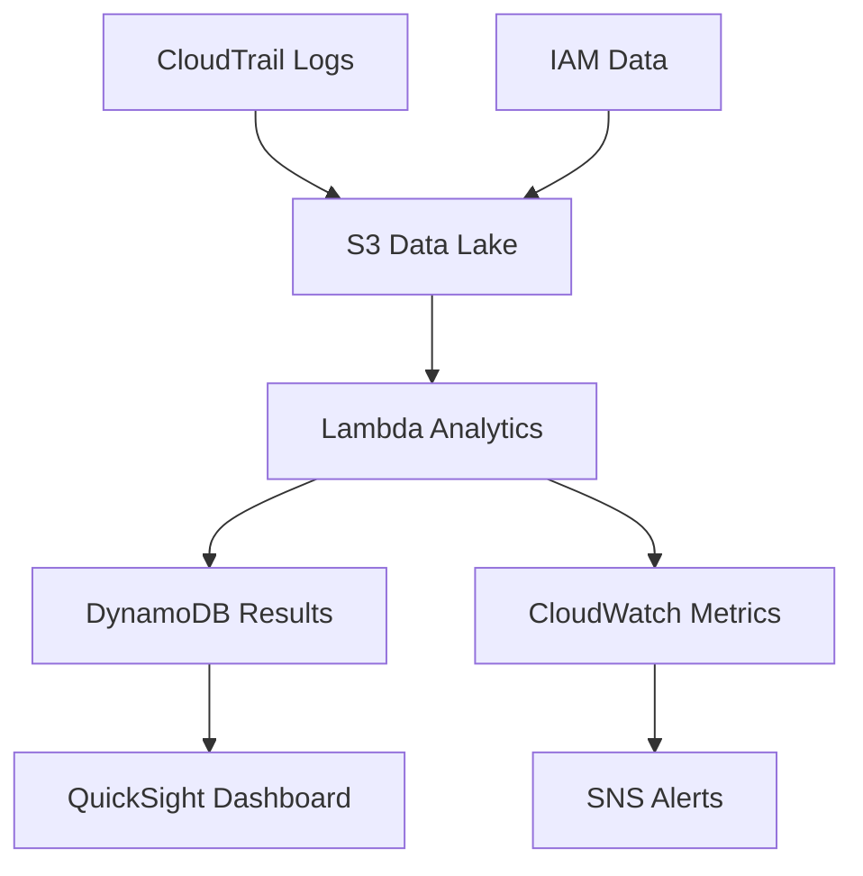

## Mục tiêu

Phân tích và giám sát việc sử dụng đặc quyền để phát hiện rủi ro bảo mật, quyền thừa, và các pattern bất thường.

## Kiến trúc Analytics



## Bước 1: Data Collection Setup

### 1.1 CloudTrail Configuration

```yaml
AWSTemplateFormatVersion: '2010-09-09'
Description: 'Privilege Analytics Data Collection'

Resources:
  PrivilegeAnalyticsTrail:
    Type: AWS::CloudTrail::Trail
    Properties:
      TrailName: PrivilegeAnalyticsTrail
      S3BucketName: !Ref AnalyticsDataBucket
      S3KeyPrefix: 'cloudtrail-logs/'
      IncludeGlobalServiceEvents: true
      IsMultiRegionTrail: true
      EnableLogFileValidation: true
```

## Bước 2: Lambda Analytics Engine

### 2.1 Tạo Lambda Function cho Analytics

1. Mở **AWS Lambda** trong console
2. Tạo function mới: **PrivilegeAnalyticsEngine**
3. Chọn runtime **Python 3.9**


### 2.2 Cấu hình Lambda để đọc S3 Data

1. Thêm IAM permissions cho S3 và DynamoDB
2. Cấu hình trigger từ S3 bucket
3. Upload analytics code


## Bước 3: Risk Scoring Engine

### 3.1 Risk Calculation Lambda

```python
import boto3
import json
import math
from datetime import datetime, timedelta

class RiskScoringEngine:
    def __init__(self):
        self.weights = {
            'privilege_level': 0.3,
            'usage_frequency': 0.2,
            'last_activity': 0.2,
            'policy_violations': 0.15,
            'external_access': 0.15
        }
    
    def calculate_user_risk_score(self, user_data, policies, groups, activity):
        """Calculate risk score for a user (0-10 scale)"""
        
        scores = {
            'privilege_level': self.score_privilege_level(policies, groups),
            'usage_frequency': self.score_usage_frequency(activity),
            'last_activity': self.score_last_activity(user_data.get('PasswordLastUsed')),
            'policy_violations': self.score_policy_violations(policies),
            'external_access': self.score_external_access(activity)
        }
        
        # Calculate weighted score
        total_score = sum(scores[factor] * self.weights[factor] for factor in scores)
        
        return {
            'total_score': round(total_score, 2),
            'factor_scores': scores,
            'risk_level': self.get_risk_level(total_score)
        }
```

## Kết quả Mong đợi

Sau khi hoàn thành:

- ✅ Automated privilege data collection
- ✅ Risk scoring for users and roles
- ✅ Athena queries for analytics
- ✅ QuickSight dashboard for visualization
- ✅ Anomaly detection and alerting

## Tiếp theo

Chuyển sang [6. Đánh giá Rủi ro](../6-danh-gia-rui-ro) để thiết lập đánh giá rủi ro toàn diện.