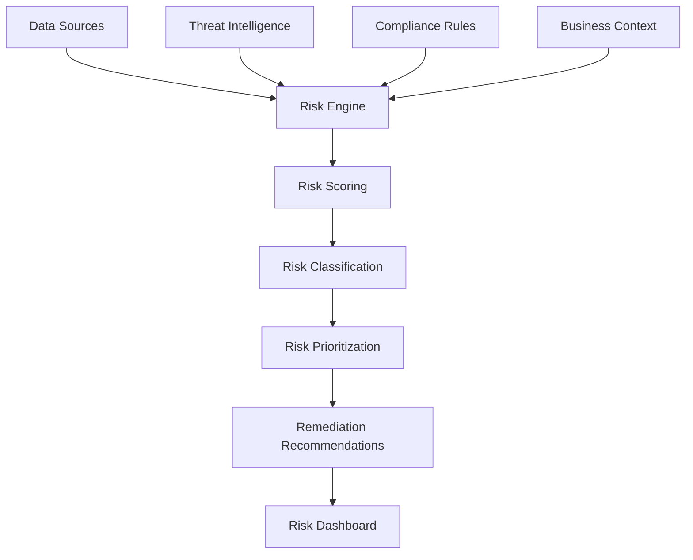

## Objective

Establish a comprehensive risk assessment system to detect, analyze, and prioritize security risks related to identity and access management.

## Risk Assessment Architecture

## Step 1: AWS Config Setup for Risk Assessment

### 1.1 Enable AWS Config

1. Open **AWS Config** in the console
2. Click **Get started**

3. Configure settings:
   - **Resource types**: All supported resource types
   - **Amazon S3 bucket**: Create new bucket
   - **Amazon SNS topic**: Create new topic

4. Choose **AWS Config role**: Create new role
5. Click **Next**

### 1.2 Add Config Rules

1. Click **Rules** in AWS Config
2. Click **Add rule**

3. Add security-related rules:
   - **iam-user-mfa-enabled**
   - **root-access-key-check**
   - **iam-password-policy**

## Step 2: GuardDuty Integration

### 2.1 Enable Amazon GuardDuty

1. Open **Amazon GuardDuty** in the console
2. Click **Get started**

3. Review service permissions
4. Click **Enable GuardDuty**

### 2.2 Configure Threat Intelligence

1. Go to **Settings** in GuardDuty
2. Click **Threat Intelligence**
3. Enable **AWS threat intelligence**

4. Configure **Malware Protection**
5. Enable **S3 Protection**

## Step 3: Security Hub Integration

### 3.1 Enable AWS Security Hub

1. Open **AWS Security Hub** in the console
2. Click **Go to Security Hub**

3. Enable security standards:
   - **AWS Foundational Security Standard**
   - **CIS AWS Foundations Benchmark**
   - **PCI DSS**

4. Click **Enable Security Hub**

### 3.2 Configure Integrations

1. Go to **Integrations** tab
2. Enable integrations:
   - **AWS Config**
   - **Amazon GuardDuty**
   - **AWS Inspector**

3. Configure custom insights for risk assessment

## Step 4: CloudWatch Dashboard for Risk Monitoring

### 4.1 Create Risk Assessment Dashboard

1. Open **Amazon CloudWatch** console
2. Click **Dashboards** in sidebar
3. Click **Create dashboard**

4. Name: **IdentityGovernanceRiskDashboard**
5. Add widgets for:
   - **Security Hub findings**
   - **GuardDuty threats**
   - **Config compliance**

### 4.2 Configure Risk Alarms

1. Click **Alarms** in CloudWatch
2. Click **Create alarm**

3. Configure alarms for:
   - **High severity findings**
   - **Critical GuardDuty threats**
   - **Config rule violations**

4. Set SNS notifications

## Expected Results

After completion:

- ✅ AWS Config monitoring compliance
- ✅ GuardDuty detecting threats
- ✅ Security Hub centralizing findings
- ✅ CloudWatch dashboard for risk metrics
- ✅ Automated alerting for high-risk events
- ✅ Integrated security monitoring

## Next Steps

Continue to [7. Monitoring Setup](../7-thiet-lap-giam-sat) to set up comprehensive monitoring.