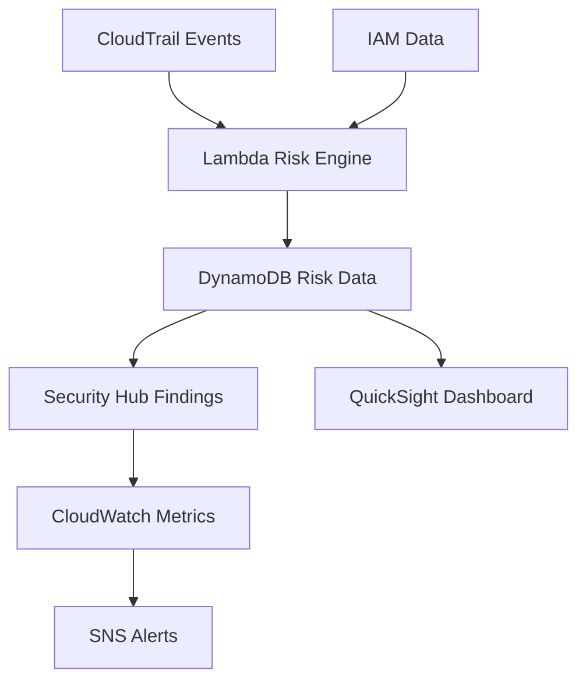

## Objective

Establish a comprehensive risk assessment system to detect, analyze, and prioritize security risks related to identity and access management.

## Risk Assessment Architecture

## Step 1: Lambda Risk Engine Setup

### 1.1 Create Risk Assessment Lambda

1. Open **AWS Lambda** in the console
2. Click **Create function**
3. Configure:
   - **Function name**: IdentityRiskEngine
   - **Runtime**: Python 3.9
   - **Role**: Create new role with DynamoDB and Security Hub permissions

### 1.2 Configure Risk Assessment Logic

1. Add environment variables:
   - **RISK_TABLE**: RiskAssessments
   - **SNS_TOPIC**: Risk alert topic ARN

2. Upload risk assessment code
3. Configure EventBridge trigger for daily execution

## Step 2: Security Hub Integration

### 3.1 Enable AWS Security Hub

1. Open **AWS Security Hub** in the console
2. Click **Go to Security Hub**

3. Enable security standards:
   - **AWS Foundational Security Standard**
   - **CIS AWS Foundations Benchmark**
   - **PCI DSS**

4. Click **Enable Security Hub**

### 3.2 Configure Integrations

1. Go to **Integrations** tab
2. Enable integrations:
   - **AWS Config**
   - **Amazon GuardDuty**
   - **AWS Inspector**

3. Configure custom insights for risk assessment

## Step 3: CloudWatch Dashboard for Risk Monitoring

### 4.1 Create Risk Assessment Dashboard

1. Open **Amazon CloudWatch** console
2. Click **Dashboards** in sidebar
3. Click **Create dashboard**

4. Name: **IdentityGovernanceRiskDashboard**
5. Add widgets for:
   - **Security Hub findings**
   - **GuardDuty threats**
   - **Config compliance**

### 4.2 Configure Risk Alarms

1. Click **Alarms** in CloudWatch
2. Click **Create alarm**

3. Configure alarms for:
   - **High severity findings**
   - **Critical GuardDuty threats**
   - **Config rule violations**

4. Set SNS notifications

## Expected Results

After completion:

- ✅ AWS Config monitoring compliance
- ✅ GuardDuty detecting threats
- ✅ Security Hub centralizing findings
- ✅ CloudWatch dashboard for risk metrics
- ✅ Automated alerting for high-risk events
- ✅ Integrated security monitoring

## Next Steps

Continue to [7. Monitoring Setup](../7-thiet-lap-giam-sat) to set up comprehensive monitoring.