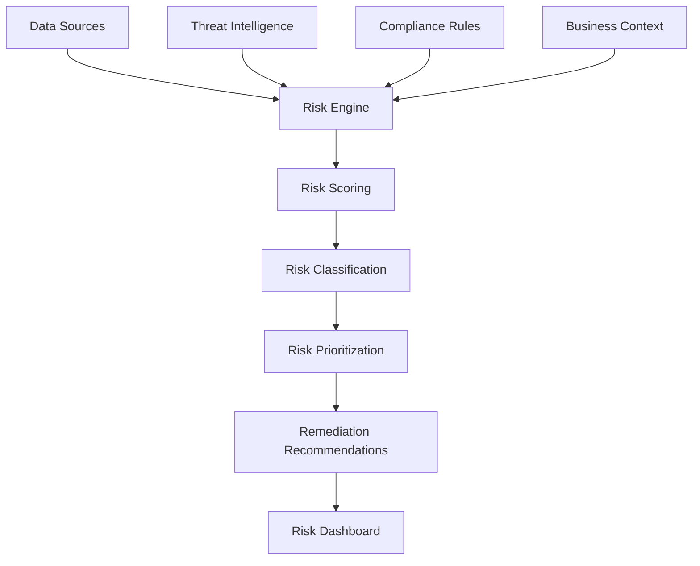

# 6. Đánh giá Rủi ro

## Mục tiêu

Thiết lập hệ thống đánh giá rủi ro toàn diện để phát hiện, phân tích và ưu tiên các rủi ro bảo mật liên quan đến identity và access management.

## Kiến trúc Risk Assessment



## Bước 1: Risk Assessment Framework

### 1.1 Risk Categories Definition

```python
import boto3
import json
from datetime import datetime, timedelta
from enum import Enum

class RiskCategory(Enum):
    PRIVILEGE_ESCALATION = "privilege_escalation"
    UNAUTHORIZED_ACCESS = "unauthorized_access"
    DATA_EXPOSURE = "data_exposure"
    COMPLIANCE_VIOLATION = "compliance_violation"
    OPERATIONAL_RISK = "operational_risk"

class RiskSeverity(Enum):
    CRITICAL = 10
    HIGH = 8
    MEDIUM = 5
    LOW = 3
    MINIMAL = 1

class RiskAssessmentFramework:
    def __init__(self):
        self.risk_rules = self.load_risk_rules()
        self.threat_intelligence = self.load_threat_intelligence()
        self.compliance_requirements = self.load_compliance_requirements()
```

## Bước 2: Threat Intelligence Integration

### 2.1 Threat Intelligence Collector

```python
import requests
import boto3
from datetime import datetime

class ThreatIntelligenceCollector:
    def __init__(self):
        self.threat_feeds = [
            {
                "name": "AWS Security Bulletins",
                "url": "https://aws.amazon.com/security/security-bulletins/",
                "type": "aws_security"
            },
            {
                "name": "MITRE ATT&CK",
                "url": "https://attack.mitre.org/",
                "type": "attack_patterns"
            }
        ]
    
    def collect_threat_intelligence(self):
        """Collect threat intelligence from various sources"""
        
        intelligence_data = {
            "collection_timestamp": datetime.now().isoformat(),
            "threat_indicators": [],
            "attack_patterns": [],
            "vulnerabilities": []
        }
        
        return intelligence_data
```

## Bước 3: Risk Monitoring và Alerting

### 3.1 Real-time Risk Monitor

```python
import boto3
import json
from datetime import datetime

class RealTimeRiskMonitor:
    def __init__(self):
        self.cloudwatch = boto3.client('cloudwatch')
        self.sns = boto3.client('sns')
        self.dynamodb = boto3.resource('dynamodb')
        self.risk_table = self.dynamodb.Table('RiskMonitoring')
    
    def process_security_event(self, event):
        """Process incoming security events for risk assessment"""
        
        event_type = event.get('eventName', '')
        source_ip = event.get('sourceIPAddress', '')
        user_identity = event.get('userIdentity', {})
        
        # Analyze event for risk indicators
        risk_score = self.calculate_event_risk_score(event)
        
        if risk_score >= 7:  # High risk threshold
            self.handle_high_risk_event(event, risk_score)
        
        return {
            'event_processed': True,
            'risk_score': risk_score,
            'action_taken': risk_score >= 7
        }
```

## Bước 4: Risk Dashboard

### 4.1 CloudFormation cho Dashboard Resources

```yaml
AWSTemplateFormatVersion: '2010-09-09'
Description: 'Risk Assessment Dashboard Resources'

Resources:
  RiskDashboard:
    Type: AWS::CloudWatch::Dashboard
    Properties:
      DashboardName: IdentityGovernanceRiskDashboard
      DashboardBody: !Sub |
        {
          "widgets": [
            {
              "type": "metric",
              "x": 0,
              "y": 0,
              "width": 12,
              "height": 6,
              "properties": {
                "metrics": [
                  [ "IdentityGovernance/Risk", "RiskScore" ],
                  [ ".", "HighRiskEvents" ]
                ],
                "period": 300,
                "stat": "Average",
                "region": "${AWS::Region}",
                "title": "Risk Metrics Overview"
              }
            }
          ]
        }
```

## Kết quả Mong đợi

Sau khi hoàn thành:

- ✅ Comprehensive risk assessment framework
- ✅ Real-time risk monitoring
- ✅ Threat intelligence integration
- ✅ Automated alerting system
- ✅ Risk dashboard and metrics
- ✅ Prioritized remediation plans

## Tiếp theo

Chuyển sang [7. Thiết lập Giám sát](../7-thiet-lap-giam-sat) để thiết lập giám sát toàn diện.