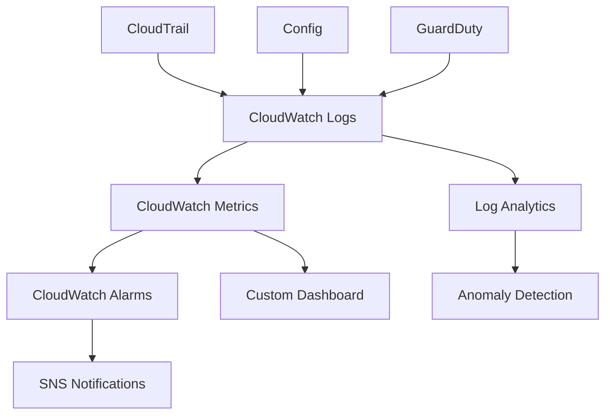

# 7. Monitoring Setup

## Objective

Set up comprehensive monitoring system to continuously track identity governance activities, detect anomalies, and ensure compliance.

## Monitoring Architecture



## Step 1: CloudWatch Monitoring Setup

### 1.1 Custom Metrics and Alarms

```yaml
AWSTemplateFormatVersion: '2010-09-09'
Description: 'Identity Governance Monitoring Infrastructure'

Parameters:
  NotificationEmail:
    Type: String
    Description: Email for monitoring alerts
    Default: security-team@company.com

Resources:
  # SNS Topic for Alerts
  MonitoringAlertsTopic:
    Type: AWS::SNS::Topic
    Properties:
      TopicName: IdentityGovernanceAlerts
      DisplayName: Identity Governance Monitoring Alerts
      Subscription:
        - Protocol: email
          Endpoint: !Ref NotificationEmail

  # CloudWatch Log Group for Identity Events
  IdentityLogGroup:
    Type: AWS::Logs::LogGroup
    Properties:
      LogGroupName: /aws/identity-governance/events
      RetentionInDays: 365
```

### 1.2 Monitoring Lambda Function

```python
import boto3
import json
import os
from datetime import datetime, timedelta

class IdentityGovernanceMonitor:
    def __init__(self):
        self.cloudwatch = boto3.client('cloudwatch')
        self.logs_client = boto3.client('logs')
        self.iam_client = boto3.client('iam')
        self.sso_client = boto3.client('sso-admin')
        self.sns_client = boto3.client('sns')
        
        self.log_group = os.environ.get('LOG_GROUP_NAME', '/aws/identity-governance/events')
        self.sns_topic = os.environ.get('SNS_TOPIC_ARN')
    
    def monitor_identity_events(self):
        """Monitor and analyze identity-related events"""
        
        monitoring_results = {
            'timestamp': datetime.now().isoformat(),
            'metrics_collected': [],
            'anomalies_detected': [],
            'alerts_sent': []
        }
        
        return monitoring_results
```

## Step 2: Log Analytics Setup

### 2.1 CloudWatch Insights Queries

```sql
-- Query 1: Failed login attempts by user
fields @timestamp, sourceIPAddress, userIdentity.userName, errorMessage
| filter eventName = "ConsoleLogin" and errorCode != "Success"
| stats count() by userIdentity.userName
| sort count desc

-- Query 2: Privilege escalation events
fields @timestamp, eventName, userIdentity.userName, sourceIPAddress
| filter eventName in ["AttachUserPolicy", "CreateRole", "PutUserPolicy"]
| sort @timestamp desc

-- Query 3: Off-hours access patterns
fields @timestamp, eventName, userIdentity.userName, sourceIPAddress
| filter @timestamp like /T(0[0-5]|2[2-3])/
| stats count() by userIdentity.userName
| sort count desc
```

### 2.2 Automated Log Analysis

```python
import boto3
import json
from datetime import datetime, timedelta

class LogAnalyzer:
    def __init__(self):
        self.logs_client = boto3.client('logs')
        self.cloudwatch = boto3.client('cloudwatch')
    
    def analyze_security_logs(self):
        """Analyze security logs for patterns and anomalies"""
        
        analysis_results = {
            'analysis_timestamp': datetime.now().isoformat(),
            'patterns_detected': [],
            'recommendations': []
        }
        
        return analysis_results
```

## Step 3: Deployment Script

### 3.1 Complete Monitoring Deployment

```bash
#!/bin/bash

echo "Deploying Identity Governance Monitoring..."

# Deploy CloudFormation stack
aws cloudformation deploy \
  --template-file monitoring-infrastructure.yaml \
  --stack-name identity-governance-monitoring \
  --parameter-overrides NotificationEmail=security-team@company.com \
  --capabilities CAPABILITY_IAM

# Create Lambda functions
echo "Creating monitoring Lambda functions..."

# Package and deploy monitoring function
zip -r monitoring-function.zip monitoring_lambda.py
aws lambda create-function \
  --function-name IdentityGovernanceMonitor \
  --runtime python3.9 \
  --role arn:aws:iam::$(aws sts get-caller-identity --query Account --output text):role/IdentityGovernanceMonitoringRole \
  --handler monitoring_lambda.lambda_handler \
  --zip-file fileb://monitoring-function.zip

echo "Monitoring setup completed successfully!"
```

## Expected Results

After completion:

- ✅ Real-time monitoring of identity events
- ✅ Custom CloudWatch metrics and alarms
- ✅ Automated log analysis
- ✅ Anomaly detection and alerting
- ✅ Comprehensive monitoring dashboard
- ✅ Scheduled monitoring tasks

## Next Steps

Continue to [8. Operational Procedures](../8-quy-trinh-van-hanh) to set up operational processes.