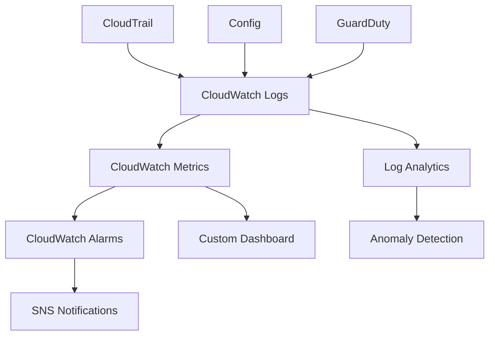

## Objective

Set up comprehensive monitoring system to continuously track identity governance activities, detect anomalies, and ensure compliance.

## Monitoring Architecture



## Step 1: CloudWatch Logs Setup

### 1.1 Create Log Groups

1. Open **Amazon CloudWatch** console
2. Click **Log groups** in sidebar
3. Click **Create log group**


4. Configure log group:
   - **Log group name**: /aws/identity-governance/events
   - **Retention setting**: 1 year


5. Click **Create**

### 1.2 Set Up SNS Topic for Alerts

1. Open **Amazon SNS** console
2. Click **Topics** in sidebar
3. Click **Create topic**


4. Configure topic:
   - **Type**: Standard
   - **Name**: IdentityGovernanceAlerts
   - **Display name**: Identity Governance Alerts


5. Create subscription with your email


## Step 2: CloudWatch Metrics and Alarms

### 2.1 Create Custom Metrics

1. In CloudWatch console, click **All metrics**
2. Click **Browse** tab
3. Create custom namespace: **IdentityGovernance**


### 2.2 Set Up Alarms

1. Click **Alarms** in CloudWatch
2. Click **Create alarm**


3. Configure alarm for failed logins:
   - **Metric**: Custom metric for failed logins
   - **Threshold**: > 5 in 5 minutes
   - **Action**: Send to SNS topic


4. Create additional alarms for:
   - **Privilege escalation events**
   - **Off-hours access**
   - **Unusual geographic access**


## Step 3: CloudWatch Insights Setup

### 3.1 Create Insights Queries

1. Click **Logs Insights** in CloudWatch
2. Select log group: **/aws/cloudtrail**
3. Create saved queries for monitoring


### 3.2 Failed Login Analysis

1. Run query for failed logins:

```sql
fields @timestamp, sourceIPAddress, userIdentity.userName, errorMessage
| filter eventName = "ConsoleLogin" and errorCode != "Success"
| stats count() by userIdentity.userName
| sort count desc
```


### 3.3 Privilege Escalation Monitoring

1. Create query for privilege changes:

```sql
fields @timestamp, eventName, userIdentity.userName, sourceIPAddress
| filter eventName in ["AttachUserPolicy", "CreateRole", "PutUserPolicy"]
| sort @timestamp desc
```


2. Save queries for regular use


## Step 4: Automated Monitoring with Lambda

### 4.1 Create Monitoring Lambda Function

1. Open **AWS Lambda** console
2. Click **Create function**
3. Configure function:
   - **Name**: IdentityGovernanceMonitor
   - **Runtime**: Python 3.9


### 4.2 Configure Lambda Triggers

1. Add **EventBridge** trigger
2. Set schedule: **rate(1 hour)**


3. Add **CloudWatch Logs** trigger for real-time analysis


### 4.3 Configure Environment Variables

1. Set environment variables:
   - **SNS_TOPIC_ARN**: Your SNS topic ARN
   - **LOG_GROUP_NAME**: /aws/identity-governance/events


## Step 5: Dashboard and Reporting

### 5.1 Create Monitoring Dashboard

1. In CloudWatch, click **Dashboards**
2. Click **Create dashboard**
3. Name: **IdentityGovernanceMonitoring**


4. Add widgets for:
   - **Failed login attempts**
   - **Privilege escalation events**
   - **Geographic access patterns**
   - **System health metrics**


### 5.2 Set Up Automated Reports

1. Create **EventBridge** rule for daily reports
2. Configure Lambda to generate reports
3. Send reports via email


## Expected Results

After completion:

- ✅ CloudWatch Logs collecting identity events
- ✅ Custom metrics and alarms configured
- ✅ CloudWatch Insights for log analysis
- ✅ Lambda functions for automated monitoring
- ✅ SNS notifications for alerts
- ✅ Comprehensive monitoring dashboard


## Next Steps

Continue to [8. Operational Procedures](../8-quy-trinh-van-hanh) to set up operational processes.