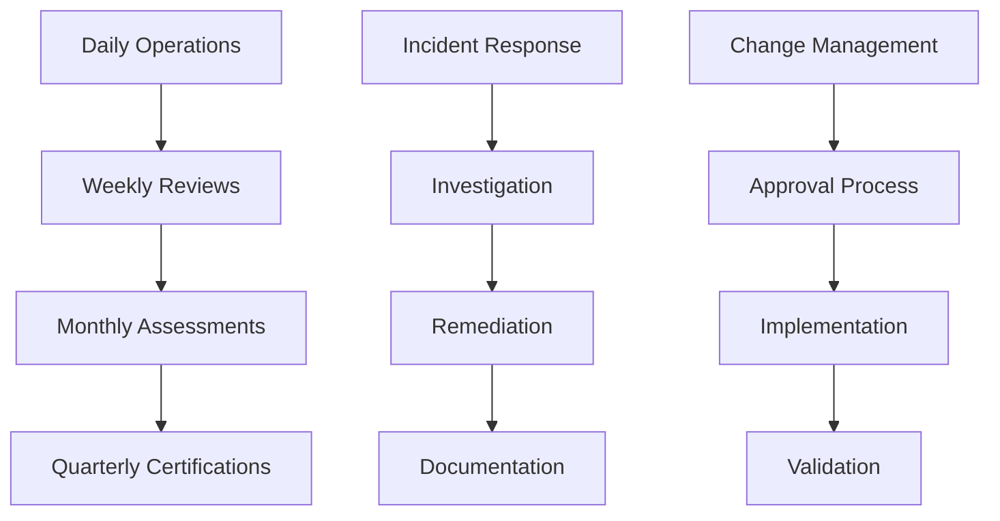

# 8. Operational Procedures

## Objective

Establish standardized operational procedures to manage identity governance effectively, ensuring consistency and compliance.

## Process Overview

## Step 1: Daily Operations Dashboard

### 1.1 Create Operations Dashboard

1. Open **Amazon CloudWatch** console
2. Click **Dashboards**
3. Click **Create dashboard**

4. Name: **DailyOperationsDashboard**
5. Add widgets for daily monitoring:
   - **Failed login attempts (last 24h)**
   - **High-risk alerts**
   - **System health status**
   - **Pending certifications**

### 1.2 Set Up Daily Checklist Automation

1. Open **AWS Systems Manager**
2. Click **Documents** in sidebar
3. Click **Create document**

4. Create **Automation document** for daily checks:
   - **Name**: DailyOperationsChecklist
   - **Document type**: Automation

5. Configure automation steps for:
   - **Security alerts review**
   - **System health validation**
   - **Backup status check**

## Step 2: Standard Operating Procedures (SOPs)

### 2.1 Create SOP Documentation in Wiki

1. Open **Amazon WorkDocs** or create **S3 bucket** for documentation
2. Create folder structure for SOPs

3. Create **SOP-001: Daily Monitoring Procedures**
4. Include sections:
   - **Purpose and Scope**
   - **Daily procedures timeline**
   - **Escalation criteria**
   - **Contact information**

### 2.2 Implement SOP Tracking

1. Create **DynamoDB table** for SOP tracking:
   - **Table name**: OperationalProcedures
   - **Primary key**: procedure_id

2. Create **Lambda function** to track SOP execution
3. Configure **EventBridge** rules for SOP scheduling

## Step 3: Weekly Review Automation

### 3.1 Set Up Weekly Review Reports

1. Open **Amazon QuickSight**
2. Create **Weekly Review Dashboard**

3. Configure data sources:
   - **CloudWatch metrics**
   - **Security Hub findings**
   - **Config compliance data**

### 3.2 Automate Weekly Report Generation

1. Create **Lambda function** for weekly reports
2. Configure **EventBridge** rule:
   - **Schedule**: Every Monday at 9:00 AM
   - **Target**: Weekly report Lambda

3. Configure report delivery via **SES**

## Step 4: Incident Response Runbooks

### 4.1 Create Digital Runbooks

1. Open **AWS Systems Manager**
2. Click **Documents**
3. Create **Command document** for incident response

4. Configure runbook sections:
   - **Incident classification**
   - **Initial response steps**
   - **Investigation procedures**
   - **Escalation matrix**

### 4.2 Implement Incident Tracking

1. Create **ServiceNow integration** or use **AWS Support Cases**
2. Configure **ChatBot** for Slack/Teams notifications

3. Set up **PagerDuty** integration for on-call management

### 4.3 Test Runbook Procedures

1. Schedule **tabletop exercises**
2. Document lessons learned
3. Update runbooks based on feedback

## Expected Results

After completion:

- ✅ CloudWatch dashboard for daily operations
- ✅ Automated SOP execution and tracking
- ✅ Weekly review reports via QuickSight
- ✅ Digital incident response runbooks
- ✅ Integrated incident tracking system
- ✅ Automated operational workflows

## Next Steps

Continue to [9. Audit Procedures](../9-quy-trinh-kiem-toan) to set up audit processes.