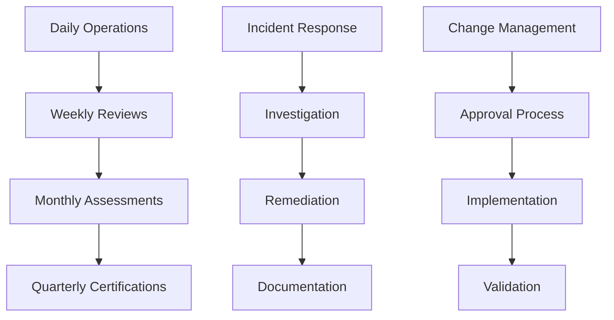

# 8. Quy trình Vận hành

## Mục tiêu

Thiết lập các quy trình vận hành chuẩn hóa để quản lý identity governance một cách hiệu quả, đảm bảo tính nhất quán và tuân thủ.

## Quy trình Tổng quan



## Bước 1: Daily Operations Procedures

### 1.1 Daily Monitoring Checklist

```python
import boto3
import json
from datetime import datetime, timedelta

class DailyOperations:
    def __init__(self):
        self.cloudwatch = boto3.client('cloudwatch')
        self.sns = boto3.client('sns')
        self.dynamodb = boto3.resource('dynamodb')
        self.operations_table = self.dynamodb.Table('OperationsLog')
    
    def execute_daily_checklist(self):
        """Execute daily operational checklist"""
        
        checklist_results = {
            'date': datetime.now().strftime('%Y-%m-%d'),
            'timestamp': datetime.now().isoformat(),
            'checks_performed': [],
            'issues_found': [],
            'actions_taken': []
        }
        
        # Daily checks
        checks = [
            ('Monitor Failed Logins', self.check_failed_logins),
            ('Review High-Risk Alerts', self.review_high_risk_alerts),
            ('Check System Health', self.check_system_health),
            ('Validate Backup Status', self.validate_backup_status),
            ('Review Pending Certifications', self.review_pending_certifications)
        ]
        
        return checklist_results
```

### 1.2 Standard Operating Procedures (SOPs)

```markdown
# Identity Governance Standard Operating Procedures

## SOP-001: Daily Monitoring Procedures

### Purpose
Ensure daily monitoring of identity governance systems and prompt response to issues.

### Scope
All identity governance monitoring activities performed daily.

### Procedure
1. **Morning Health Check (9:00 AM)**
   - Review CloudWatch dashboard
   - Check for active alarms
   - Verify system availability

2. **Failed Login Review (10:00 AM)**
   - Analyze failed login patterns
   - Investigate suspicious activities
   - Document findings

3. **Risk Alert Review (2:00 PM)**
   - Review high-risk alerts
   - Prioritize investigations
   - Assign remediation tasks

4. **End-of-Day Summary (5:00 PM)**
   - Generate daily report
   - Update incident tracking
   - Plan next day activities

### Escalation Criteria
- Critical alarms: Immediate escalation
- High-risk events: 2-hour response time
- System outages: Immediate escalation
```

## Bước 2: Weekly Review Procedures

### 2.1 Weekly Assessment Script

```python
import boto3
import json
from datetime import datetime, timedelta

class WeeklyReview:
    def __init__(self):
        self.cloudwatch = boto3.client('cloudwatch')
        self.s3_client = boto3.client('s3')
        self.athena_client = boto3.client('athena')
    
    def execute_weekly_review(self):
        """Execute weekly identity governance review"""
        
        review_results = {
            'week_ending': datetime.now().strftime('%Y-%m-%d'),
            'timestamp': datetime.now().isoformat(),
            'metrics_summary': {},
            'trend_analysis': {},
            'recommendations': []
        }
        
        # Collect weekly metrics
        review_results['metrics_summary'] = self.collect_weekly_metrics()
        
        # Perform trend analysis
        review_results['trend_analysis'] = self.analyze_trends()
        
        # Generate recommendations
        review_results['recommendations'] = self.generate_weekly_recommendations()
        
        return review_results
```

## Bước 3: Runbook Templates

### 3.1 Incident Response Runbook

```yaml
# Incident Response Runbook Template
incident_response:
  incident_id: "INC-{YYYY-MM-DD}-{###}"
  
  classification:
    severity: "[P1|P2|P3|P4]"
    category: "[Security|Availability|Performance|Compliance]"
    impact: "[Critical|High|Medium|Low]"
  
  initial_response:
    - step: "Acknowledge incident"
      owner: "On-call engineer"
      sla: "15 minutes"
    
    - step: "Assess severity and impact"
      owner: "Incident commander"
      sla: "30 minutes"
    
    - step: "Activate response team"
      owner: "Incident commander"
      sla: "30 minutes"
  
  investigation:
    - step: "Collect initial evidence"
      actions:
        - "Export relevant CloudTrail logs"
        - "Capture system state"
        - "Document timeline"
    
    - step: "Analyze root cause"
      actions:
        - "Review logs and metrics"
        - "Interview stakeholders"
        - "Test hypotheses"
```

## Kết quả Mong đợi

Sau khi hoàn thành:

- ✅ Standardized daily operations procedures
- ✅ Weekly review and trend analysis
- ✅ Incident response runbooks
- ✅ Change management processes
- ✅ Operational documentation
- ✅ Automated operational tasks

## Tiếp theo

Chuyển sang [9. Quy trình Kiểm toán](../9-quy-trinh-kiem-toan) để thiết lập quy trình kiểm toán.