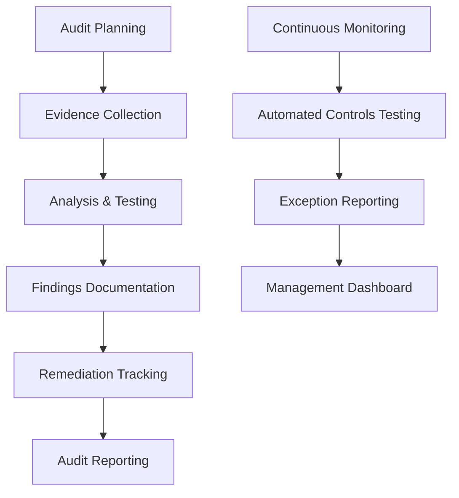

## Objective

Establish comprehensive audit procedures to ensure compliance with security, legal, and internal requirements in identity governance management.

## Audit Architecture

## Step 1: Lambda-based Audit Framework Setup

### 1.1 Create Audit Lambda Function

1. Open **AWS Lambda** console
2. Create function: **ComplianceAuditEngine**
3. Configure EventBridge trigger for daily execution

### 1.2 Configure Audit Logic

1. Add environment variables:
   - **AUDIT_TABLE**: RiskAssessments
   - **SNS_TOPIC**: Audit notification topic

2. Upload audit code to check:
   - **IAM policies compliance**
   - **Access patterns analysis**
   - **Security Hub findings review**

## Step 2: DynamoDB Audit Data Storage

### 2.1 Configure Audit Data Storage

1. Use existing **DynamoDB** table: **RiskAssessments**
2. Lambda function stores audit results
3. Configure data retention policies

### 2.2 Set Up CloudWatch Monitoring

1. Lambda sends metrics to **CloudWatch**
2. Configure alarms for audit failures
3. Set up **SNS** notifications

## Step 3: Control Testing and Evidence Review

### 3.1 Review Control Evidence

1. Navigate to **Control sets** in your assessment
2. Review each control:
   - **Evidence status**
   - **Compliance rating**
   - **Comments and findings**

3. Upload additional evidence if needed
4. Add control testing notes

### 3.2 Document Findings

1. For each control, document:
   - **Testing procedures performed**
   - **Results and observations**
   - **Exceptions or deficiencies**
   - **Recommendations**

2. Assign **risk ratings** to findings
3. Set **remediation timelines**

## Step 4: Generate Audit Reports

### 4.1 Create Assessment Report

1. Click **Generate assessment report**
2. Select report format: **PDF** or **HTML**

3. Configure report sections:
   - **Executive summary**
   - **Control testing results**
   - **Findings and recommendations**
   - **Evidence appendix**

### 4.2 Share Report with Stakeholders

1. Download completed report
2. Share with:
   - **Executive leadership**
   - **Audit committee**
   - **Compliance team**

## Expected Results

After completion:

- ✅ AWS Audit Manager configured
- ✅ Custom audit framework created
- ✅ Assessment with evidence collection
- ✅ Control testing documentation
- ✅ Comprehensive audit reports
- ✅ Stakeholder communication process

## Next Steps

Continue to [10. Compliance Validation](../10-xac-thuc-tuan-thu) to complete the workshop.