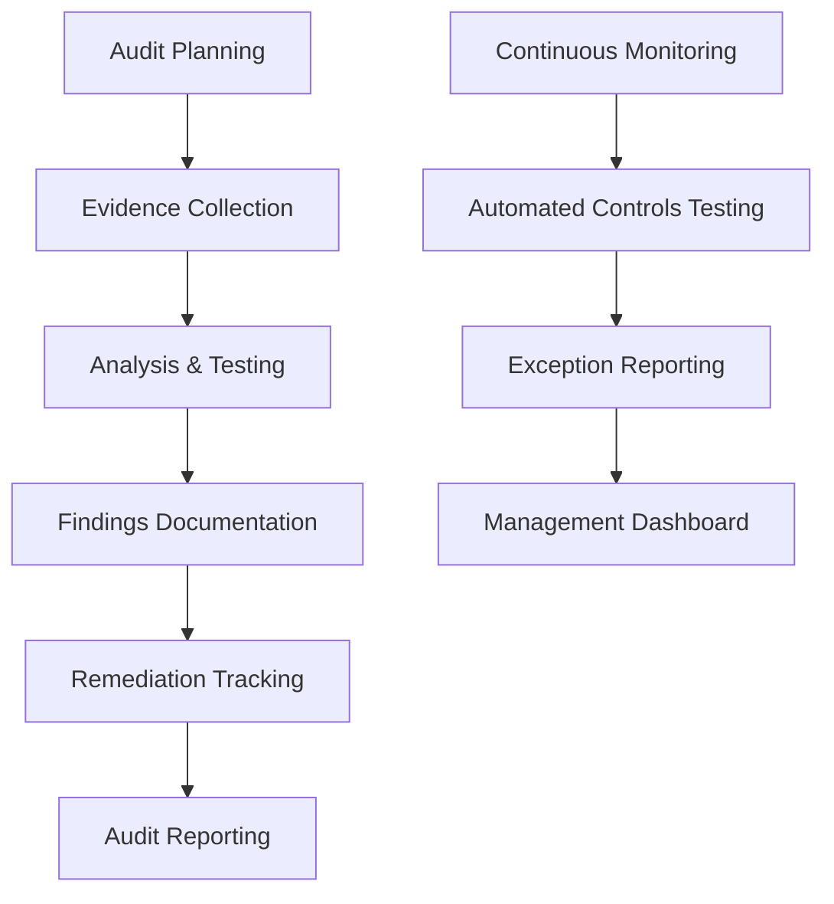

# 9. Audit Procedures

## Objective

Establish comprehensive audit procedures to ensure compliance with security, legal, and internal requirements in identity governance management.

## Audit Architecture

## Step 1: AWS Audit Manager Setup

### 1.1 Enable AWS Audit Manager

1. Open **AWS Audit Manager** in the console
2. Click **Get started**

3. Configure service settings:
   - **Enable data collection**: Yes
   - **KMS encryption**: Use default key
   - **S3 bucket**: Create new bucket for audit evidence

4. Click **Complete setup**

### 1.2 Create Audit Framework

1. Click **Assessment frameworks** in sidebar
2. Click **Create custom framework**

3. Configure framework:
   - **Name**: Identity Governance Audit Framework
   - **Description**: Comprehensive identity governance audit
   - **Compliance type**: SOX, SOC2, ISO27001

4. Add control sets for:
   - **Access Management**
   - **Privilege Governance**
   - **Compliance Monitoring**

## Step 2: Create Assessment

### 2.1 Start New Assessment

1. Click **Assessments** in Audit Manager
2. Click **Create assessment**

3. Configure assessment:
   - **Name**: Q1 Identity Governance Audit
   - **Framework**: Identity Governance Audit Framework
   - **Scope**: Select AWS accounts and services

4. Assign roles:
   - **Assessment owner**: Security team lead
   - **Reviewers**: Compliance team

### 2.2 Configure Evidence Collection

1. Set up **automatic evidence collection**:
   - **AWS Config**: Compliance data
   - **CloudTrail**: Activity logs
   - **Security Hub**: Security findings

2. Configure **manual evidence** upload process

## Step 3: Control Testing and Evidence Review

### 3.1 Review Control Evidence

1. Navigate to **Control sets** in your assessment
2. Review each control:
   - **Evidence status**
   - **Compliance rating**
   - **Comments and findings**

3. Upload additional evidence if needed
4. Add control testing notes

### 3.2 Document Findings

1. For each control, document:
   - **Testing procedures performed**
   - **Results and observations**
   - **Exceptions or deficiencies**
   - **Recommendations**

2. Assign **risk ratings** to findings
3. Set **remediation timelines**

## Step 4: Generate Audit Reports

### 4.1 Create Assessment Report

1. Click **Generate assessment report**
2. Select report format: **PDF** or **HTML**

3. Configure report sections:
   - **Executive summary**
   - **Control testing results**
   - **Findings and recommendations**
   - **Evidence appendix**

### 4.2 Share Report with Stakeholders

1. Download completed report
2. Share with:
   - **Executive leadership**
   - **Audit committee**
   - **Compliance team**

## Expected Results

After completion:

- ✅ AWS Audit Manager configured
- ✅ Custom audit framework created
- ✅ Assessment with evidence collection
- ✅ Control testing documentation
- ✅ Comprehensive audit reports
- ✅ Stakeholder communication process

## Next Steps

Continue to [10. Compliance Validation](../10-xac-thuc-tuan-thu) to complete the workshop.