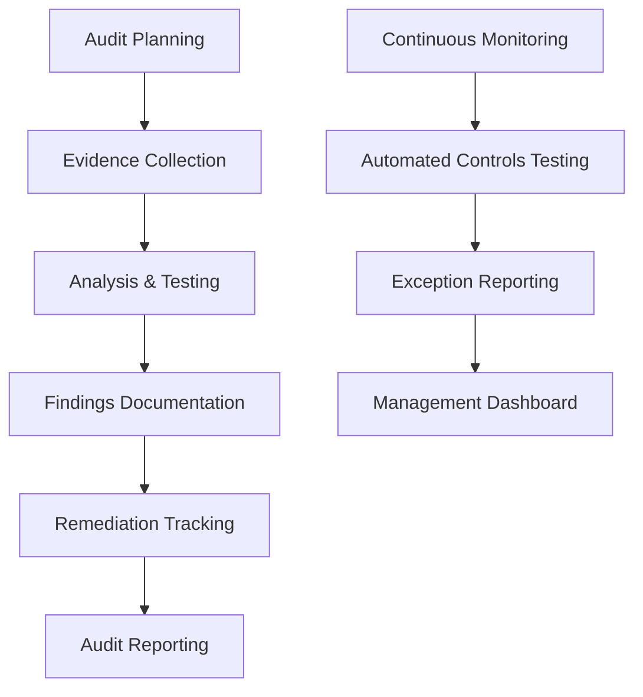

## Mục tiêu

Thiết lập quy trình kiểm toán toàn diện để đảm bảo tuân thủ các yêu cầu bảo mật, pháp lý và nội bộ trong quản lý identity governance.

## Kiến trúc Audit



## Bước 1: Audit Framework Setup

### 1.1 Audit Control Matrix

```python
import boto3
import json
from datetime import datetime, timedelta
from enum import Enum

class AuditFramework:
    def __init__(self):
        self.s3_client = boto3.client('s3')
        self.athena_client = boto3.client('athena')
        self.dynamodb = boto3.resource('dynamodb')
        self.audit_table = self.dynamodb.Table('AuditFindings')
        
        # Define audit controls
        self.audit_controls = self.load_audit_controls()
    
    def load_audit_controls(self):
        """Load comprehensive audit control matrix"""
        
        return {
            "access_management": [
                {
                    "control_id": "AM-001",
                    "control_name": "User Access Provisioning",
                    "description": "Verify user access is properly authorized and documented",
                    "frequency": "Quarterly",
                    "test_procedure": self.test_user_provisioning,
                    "compliance_frameworks": ["SOX", "SOC2", "ISO27001"]
                }
            ]
        }
```

## Bước 2: Continuous Audit Monitoring

### 2.1 Lambda-based Compliance Monitoring

1. Mở **AWS Lambda** trong console
2. Tạo function: **ComplianceAuditMonitor**
3. Cấu hình trigger từ EventBridge (daily schedule)


4. Upload code kiểm tra compliance:
   - Kiểm tra IAM policies
   - Kiểm tra access patterns
   - Ghi kết quả vào DynamoDB


5. Cấu hình CloudWatch Logs để theo dõi


## Bước 3: Audit Report Generation

### 3.1 Automated Report Generator

```python
import boto3
import json
from datetime import datetime, timedelta
from jinja2 import Template

class AuditReportGenerator:
    def __init__(self):
        self.s3_client = boto3.client('s3')
        self.ses_client = boto3.client('ses')
    
    def generate_monthly_audit_report(self):
        """Generate comprehensive monthly audit report"""
        
        report_data = {
            "report_period": datetime.now().strftime("%Y-%m"),
            "generated_date": datetime.now().isoformat(),
            "executive_summary": {},
            "control_effectiveness": {},
            "findings_summary": {},
            "trend_analysis": {},
            "recommendations": []
        }
        
        # Collect audit data from S3
        audit_data = self.collect_monthly_audit_data()
        
        # Generate report sections
        report_data["executive_summary"] = self.generate_executive_summary(audit_data)
        
        return report_data
```

## Kết quả Mong đợi

Sau khi hoàn thành:

- ✅ Comprehensive audit framework
- ✅ Automated control testing
- ✅ Continuous compliance monitoring
- ✅ Detailed audit reports
- ✅ Finding tracking and remediation
- ✅ Stakeholder communication

## Tiếp theo

Chuyển sang [10. Xác thực Tuân thủ](../10-xac-thuc-tuan-thu) để hoàn thành workshop.