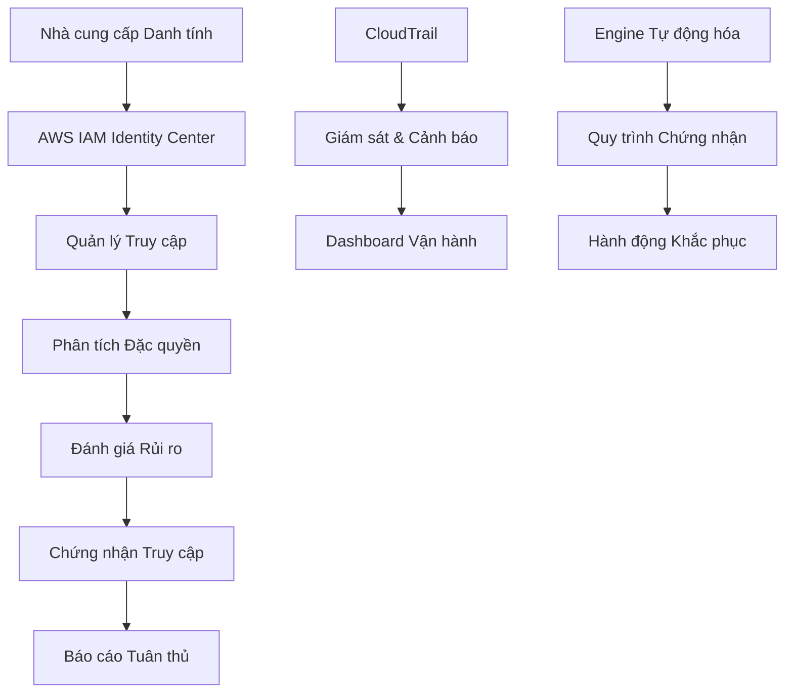

# Workshop Quản trị Danh tính với Chứng nhận Truy cập

## Tổng quan Workshop

Workshop toàn diện này hướng dẫn bạn triển khai Quản trị Danh tính với Chứng nhận Truy cập trên AWS, bao gồm các thực hành bảo mật nâng cao và yêu cầu tuân thủ.

## Các Module Workshop



## Tổng quan Kiến trúc

## Lợi ích Chính

- **Bảo mật Nâng cao**: Kiểm soát truy cập nghiêm ngặt và giám sát liên tục
- **Tuân thủ Quy định**: Đáp ứng yêu cầu SOX, SOC2, ISO27001
- **Hiệu quả Vận hành**: Quy trình chứng nhận và khắc phục tự động
- **Quản lý Rủi ro**: Đánh giá và giảm thiểu rủi ro chủ động

## Yêu cầu Tiên quyết

- Tài khoản AWS với quyền Administrator
- Hiểu biết cơ bản về AWS IAM và Organizations
- Kiến thức về các framework tuân thủ
- Kinh nghiệm với Python và AWS CLI
